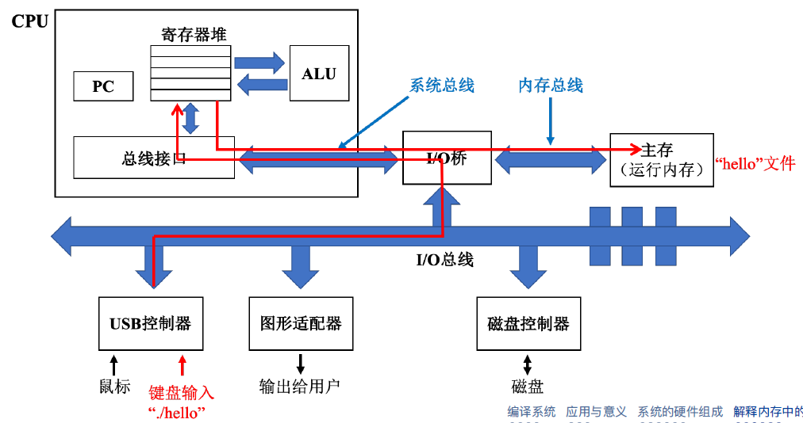
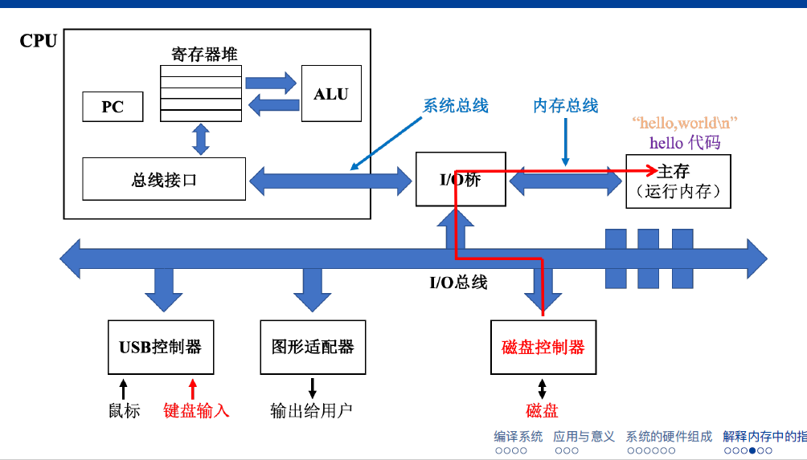
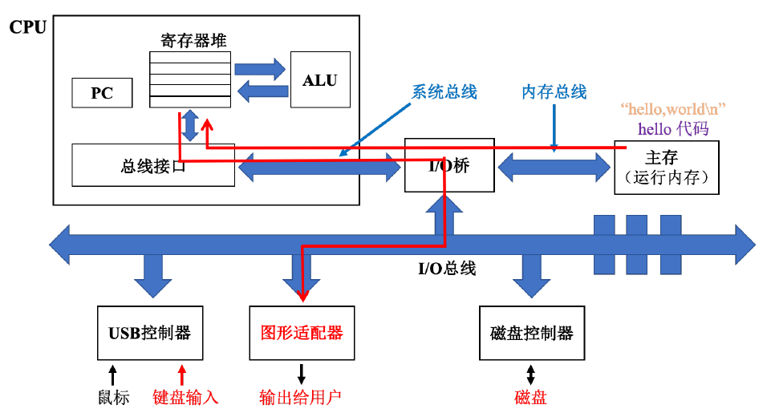
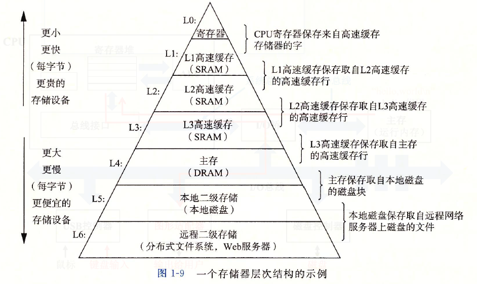
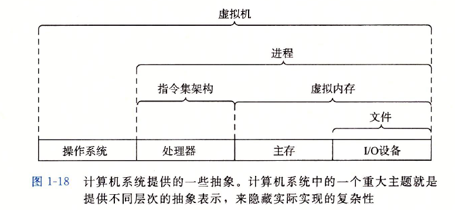
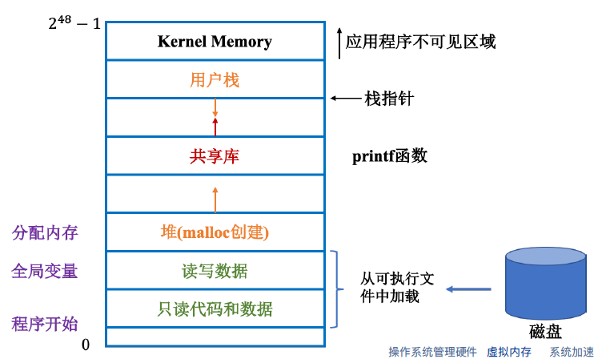
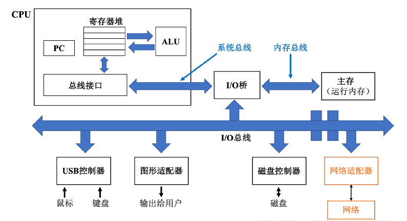
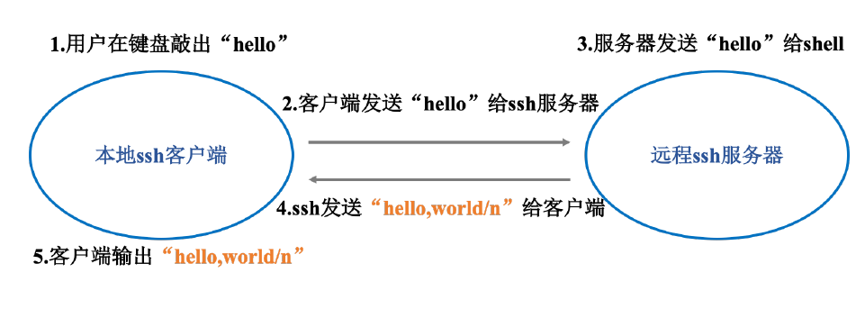
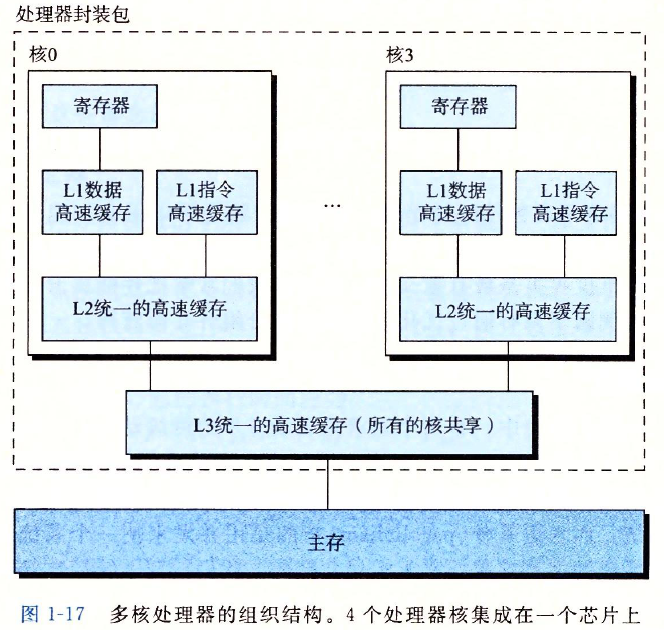

# 基本计算机系统
## 1.1 信息就是位+上下文
1. 程序由源程序开始，也就是文本文件（由ASCII字符构成的文件）
2. 源程序是一个0，1组成的位。8个位为1个字节。程序是以字节序列的方式储存在文件中的
3.  一个同样的字节序列表示的东西可能不同
##  1.2 编译系统
1. 由预处理器（cpp）、编译器（ccl）、汇编器（as）和链接器（ld）构成
2. 好处：
   1. 优化程序性能
   2. 理解连接错误
   3. 避免安全漏洞，尤其是缓冲区泄露
3. 流程图：

在最后的链接阶段，编译器会帮助我们调用预编译好的文件printf.o用于传输printf的机器指令，ld负责帮助将它与hello.o合并
##  1.3 系统硬件
1. 总览图：

2. 总线： 贯穿整个系统的一组电子管道，负责携带信息字节并传递。总线传递的基本单位为字（word），字的字节数（即字长）由系统设定，并不固定
3. I/O设备： 
图中的IO设备有鼠标键盘、显示器、磁盘 
每个I/O设备都通过一个控制器或者适配器与I/O总线相连，去传递信息。适配器和控制器的区别在于封装方式：前者是一块插在主板的卡，后者是I/O设备本身或者系统的主板上的芯片组
4. 主存： 
即内存，是一个临时存储设备，用来存放正在运行的程序及其数据。是一个线性的字节数组，从0开始，每一个字节都有唯一的地址
5. 处理器： 
解释或者执行主存中的指令，指令集架构是其抽象。包含PC、寄存器堆、ALU（算数/逻辑计算单元）三部分 
程序计数器（PC）：核心是一个大小为一字的存储设备，用于存储指令的地址。PC在任何时刻，都指向主存中的某条机器语言指令的地址。PC的执行顺序严格遵守指令集架构 
运算过程：例如计算两个变量a+b 的和，处理器从内存中读取a 的值暂存在寄存器X 中，读取B 的值暂存在寄存器Y中，这个操作会覆盖寄存器中原来的数值。完成后，ALU会从复制寄存器X 和Y 中保存的数值，然后进行算术运算，得到的结果会保存到寄存器X 或者寄存器Y 中，此时寄存器中原来的数值会被新的数值覆盖。
## 1.4 程序是如何运行的
1. 向shell输入指令./hello

2. shell执行指令加载磁盘的hello.c到主存，使用DMA（直接存储器存取）技术

3. 处理器执行位于主存的代码与数据。主存中的"hello,world\n"被放置在寄存器中并被I/O设备输出

4. 高速缓存的必要性
我们在执行程序时要不断进行复制，减慢了程序的工作。处理器从寄存器读文件要远快于主存 
通过在CPU中内置高速缓存存储器（cache）可以突破寄存器的大小限制，存储更多文件。高速缓存中存储经常访问的数据以加快运算速度 
目前流行有三级高速缓存：L1、L2和L3。三者访问速度逐渐降低，但是容量逐渐增大 
L1 cache 访问速度与访问寄存器文件基本一致。
## 1.5 存储设备的结构

层次结构的主要思想就是上一层存储器是低一层存储器的高速缓存
## 1.6 操作系统管理硬件
1. 应用程序必须通过操作系统来完成与硬件的交互
2. 目的：
   1. 防止硬件被失控的应用程序滥用
   2. 操作系统提供统一机制控制复杂的底层硬件
3. 操作系统通过进程、虚拟内存和文件来实现两个目的。文件是对IO 设备的
抽象；虚拟内存是对内存和磁盘IO 的抽象；进程是对处理器、内存以及IO 设备的抽象。

4. 进程：
   1. 一个系统可以执行多个进程。进程数可以大于CPU个数。一个处理器在一个时刻只能执行一个进程。多进程执行依靠并发
   2. 并发：一个进程的指令与另一个进程指令交错运行
   3. 操作系统的这种交错进程执行被称为上下文切换
      1. 上下文就是进程运行所需的所有状态信息，比如说主存的内容、PC的当前值。
      2. 当操作系统决定将控制权从一个进程转移到另一个进程，就会发生上下文切换。即保存当前进程的上下文，恢复新进程的上下文。控制权转移到新进程中，新进程会从上次停止的地方开始
      3. 示例
      
      我们通过shell运行hello，hello运行完后，会再次切换回shell并等待下一个命令行输入
      这种进程转换由内核（kernel）实现。内核是操作系统代码常驻主存的部分，当应用程序需要OS执行操作，他就会执行一条系统调用指令，将控制权给内核。因此该图示例会有用户代码和内核代码两部分。
      内核不是独立的进程
5. 线程
   1. 一个进程有多个线程作为执行单元组成
   2. 每个线程都运行在进程的上下文中，共享代码和数据。
   3. 例子：一个微信程序就是一个进程，而我们在微信里一边文字聊天、一边视频聊天、一边传输文件就是三个线程同时进行
6. 虚拟内存：
   1. 操作系统为每个进程提供了一个假象，就是每个进程都在独自占用整个内存空间，每个进程看到的内存都是一样的，我们称之为虚拟地址空间
   2. 示意图：从下往上看，地址是增大的。最下面是0 地址
   
   1. 程序的代码和数据：
    这个区域的内容是从可执行目标文件中加载而来的，对所有的进程来讲，代码都是从固定的地址开始。 读/写数据区域：C语言中，全局变量就是存放在这里 
   程序的代码和数据区在程序一开始的时候就被指定了大小
   1. 堆：堆可以在运行时动态的扩展和收缩
   2. 共享库：存放标准库、数学库这一类代码和数据
   3. 用户栈：栈的增长方向是从高地址到低地址，可以动态收缩或扩张 函数调用的本质就是压栈:每一次当程序进行函数调用的时候，栈就会增长，函数执行完毕返回时，栈就会收缩
   4. 内核虚拟内存：这个区域是为内核保留的区域，应用程序不可读取该区域的数据，也无法直接调用内核中的函数
7. 文件：
   1. 文件就是字节序列
   2. linux一切皆文件，所有设备、网络等都可以视为文件，系统中所有的输入和输出都是系统函数通过读写文件来完成

## 1.7 系统之间的网络通信
1. 网络可以视为一个I/O设备

比如系统从主存复制一串字节到网络适配器，就可以通过网络把数据送达其他终端
2. ssh：由于telnet 的安全性问题，目前ssh 的连接方式的更加普遍

# 计算机拓展
## 2.1 系统加速
1. 任务：并行计算所处理的对象
2. 工作量：处理某任务的所需的各种开销的总和
3. 执行率：每个处理器单位时间能完成的工作量
4. 加速比：给定一个任务，加速比 = 一个处理器做完任务的耗时/n个处理器做完任务的耗时.
5. Amdahl's law： 
   1. 定义：$\alpha \in [0,1]$是某任务无法并行处理部分的比例。如果任务工作量一定，且处理器执行率均相同。对于任意n个处理器，相比于1个处理器，我们能取得的加速比$S(n) < \frac{1}{\alpha}$，即S(n)存在上界
   2. 证明：R：处理器执行率；W总任务量，T(·)为处理任务所需要的的时间，则： 
   $T(1)=\frac{W}{R},T(n)=\frac{\alpha W}{R} + \frac{(1-\alpha)W}{nR}$

   于是有加速比$S(n)=\frac{T(1)}{T(n)}=\frac{1}{\alpha+\frac{(1-\alpha)}{n}} 

6. Gustafson's law：
   1. 定义：假设该任务的工作量可以随着处理器个数缩放，从而保持处理时间固定. 则对任意n个处理器，相比于1个处理器，能够取得的加速比S(n)不存在上界
   2. 证明：设每个处理器执行率为R，此时n个处理器面对的工作总量为：$W'=\alpha W + (1- \alpha)nW$。则：$T(1)=\frac{W'}{R},T(n)=\frac{\alpha W}{R} + \frac{(1-\alpha)nW}{nR}=\frac{W}{R}$此时加速比为：$S'(n)=\frac{T(1)}{T(n)}=\alpha + (1- \alpha)n$。即可并行的nW部分会在n台处理器并行后将n消除，因此并行部分一个处理器的耗时比n个处理器耗时多n倍

   
7. 孙-倪定律
   1. 定义：假设该任务的可并行部分随着处理器个数n 按照因子G(n)缩放，则对于$\forall n$，相比于一个处理器，加速比$S^*(n)=\frac{\alpha + (1- \alpha)G(n)}{\alpha + (1- \alpha)\frac{G(n)}{n}}$
   2. 证明：

   设每个处理器执行率为R，此时单位工作量为W。如果有n个处理器，此时单个处理器面对的工作量为：$W^*=\alpha W + (1- \alpha)G(n)W$。那么,$T(1)=\frac{W^*}{R},T(n)=\frac{\alpha W}{R}+\frac{(1- \alpha)G(n)W}{nR}$
加速比为：$S^*(n) = \frac{T(1)}{T(n)}=\frac{\alpha  + (1- \alpha)G(n)}{\alpha  + (1- \alpha)\frac{G(n)}{n}}$
   3. Sun-Ni 定律是系统加速计算分析的统合形式，G(n)=1，则可以推出Amdahl；G(n)=n，推出Gustafson
   
## 2.2 并发与并行
1. 并发：具有多个活动的系统
2. 并行：使用并发使一个系统运行的更快
3. 线程级并发：最高抽象层级的并发
   1. 使用线程，实现一个进程中执行多个控制流
   2. 多核处理器：一个处理器有多个CPU核心，每个核都有自己的L1和L2高速缓存。L1分为两部分：一个保存最近取到的指令，一个存放数据
   
   3. 超线程：又称同时多线程，这是一项允许一个CPU执行多个控制流的技术。当一个线程因为读取数据而进入等待状态时，CPU 可以去执行另外一个线程，其中线程之间的切换只需要极少的时间代价
4. 指令集并行：较低的抽象层次
   1. 定义：处理器可以同时执行多条指令的属性
   2. 超标量处理器：处理器可以做到比一个周期一条指令更快的执行速率
5. 单指令、多数据并行：最低层级的并行
   1. 单指令，多数据：又称SIMD并行，允许一条指令产生多个可以并行执行的操作