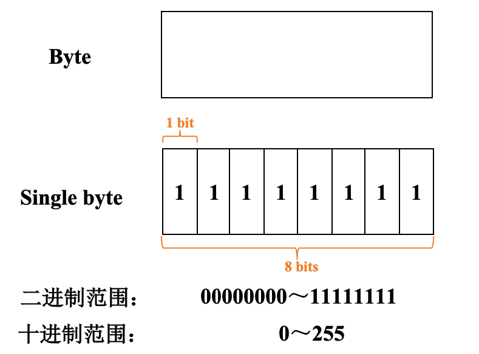
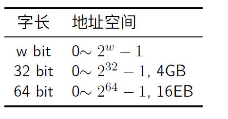
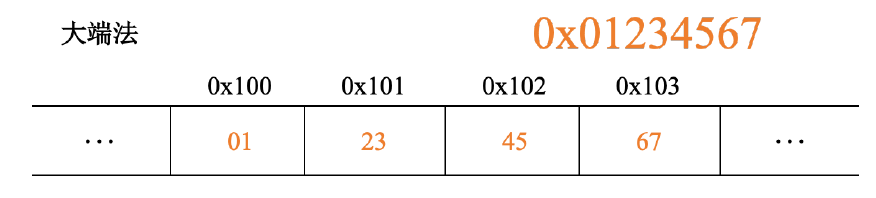
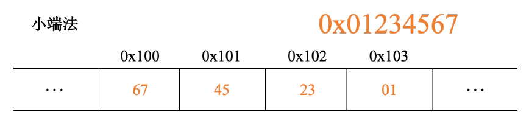
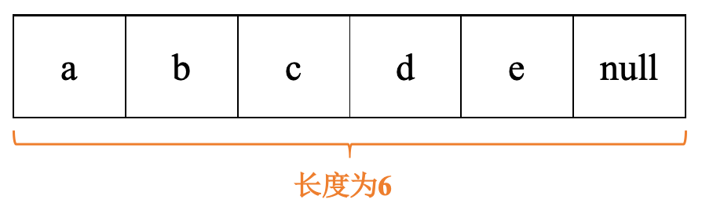
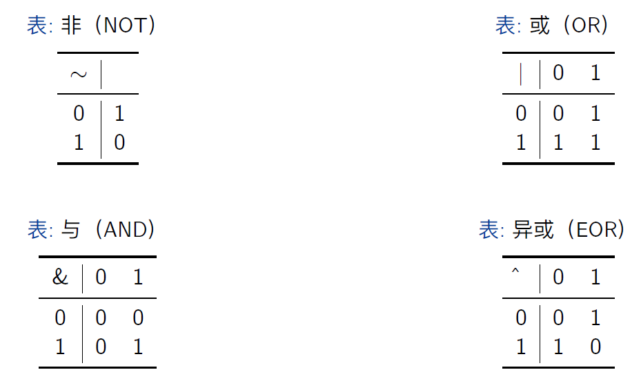

# 信息存储
## 1. 一些基础概念
   1. 位：0或1
   2. 溢出：计算机只以有限的位表示数字，如果结果太大超过了位的表示，就会产生溢出
   3. 由于计算机精度有限，浮点运算是不可结合的
   4. 字节：最小的可寻址内存单位，计算机无法直接访问位，最小只能访问到字节。一般8bit=1byte
   
   5. 程序将内存视为一个非常大的数组，称为虚拟内存。
   6. 地址：内存的每一个字节均由一个唯一的数字标识，称为（虚拟）内存的地址。这些所有的地址的集合就称为虚拟地址空间
## 2. 十六进制
1. 一般简写为hex
2. 0~9和A~F代表16个可能的值
3. C语言中以0x或者0X开头标识十六进制。表示16进制时，A和F可以不用大写，可以大小写混写
4. 转换窍门：
   1. 十六进制转换成二进制：将十六进制每个数字转换成二进制，并且拼接成一个整数字串
   
   2. 二进制转16进制：从右至左，每四个数字为一组，最左侧的一组可能不足4个数字，用0在左侧补足即可
   
   3. 十进制转二进制：当$x=2^n$，此时x可以简单写成二进制，为1后面跟着n个0
   4. 十进制转16进制：
      1. 如果$x=2^n$，那么有n=i+4j，则转成16进制时首个数字为$2^i$，首个数字后紧跟j个0。比如$2048=2^11$，则$n=11=3+4*2$，从而16进制表示为：0x800
      2. 用数字除以16，得到商q和余数r。r为16进制最低位数字，然后q反复执行这个过程，可以得到16进制的数字：
      
   5. 任意进制转10进制：比如有一个由$a_1$为最高位的n位的16进制数字，那么就为$a_1 * 16^{n-1}*……*a_i * 16^0$
## 3. 字
1. 每台计算机都有一个字长，知名指针数据的大小。
2. 虚拟地址以这样的一个字进行编码。字长决定了虚拟地址空间最大值。
3. 32位程序与64位程序的区别在于编译时采用多少位大小的字长，而非运行机器的类型
4. 64位的字长为64bit，也就是说一般使用8字节地址；32位系统一般使用4字节地址

## 4. 寻址与字节顺序
1. 多字节对象一般被储存为连续的字节序列，对象的地址为所用字节中最小的地址。比如int32 x，4个字节为0x100、0x101、0x102、0x103，但是x的地址为0x100
2. 大端法：最高有效字节存储在最前面，也就是低地址处。你可以把它看成是一种正序存储
3. 小端法：最低有效字节存储在在最前面，你可以理解为一种逆序存储

4. 在上面的例子中，x为一个int，十六进制为0x01234567。一个字最多只能装2个16进制数字，因为一个字如果是8bit，那么10进制取值范围为0~255，那么FF已经是可以达到的最大值
5. 具体使用什么端，要看系统设计。两种都很流行。现在甚至还有双端操作系统，即人工手动设定到底采用小端还是大端

## 5. 表示字符串
1. C语言中，字符串被编码为NULL 字符（值为0）结尾的字符数组，每个字符都由某个标准编码来进行表示，最常见的是ASCII

2. 十进制阿拉伯数字0~9的ASCII码都是0x3i，i为对应的数字。比如十进制数字9的ascii是0x39。字符串最后必以00终止（即null）。因此字符串“12345”的16进制码为 31 32 33 34 35 00. 
3. 使用ascii码表示字符串在任何系统上结果相同，因此文本数据比二进制数据具有更强的平台独立性

## 6. 位运算
1. 与非或异或：
 
非：$\neg$ 
与：$\land$ 
或：$\lor$ 
异或：$\bigoplus$，P和Q为真但是不能同时为真
2. 位向量运算：两个等长的，由01构成的向量进行布尔运算，例子如下：

3. 布尔运算中，与对或满足分配率，或也对与满足分配率
4. 加法逆元：值x，存在一个值-x使得，x+(-x)=0，那么-x称为加法逆元
5. 布尔环：长度为w的位向量进行非、异或、与运算时，可以形成布尔环。布尔环中，用全0的位向量表示0。那么加法运算为异或，此时任何值a的加法逆元为自己。并且布尔环中，加法满足结合律(a^b)^a=0
6. 位向量表示有限集合： 
   1. 有全集$U={0,1,...,w-1}$，A为全集U的子集，w为位向量长度根据具体集合。比如给定所有集合中最大元素为8，那么w就设定为9
   2. 位向量：$[a_{w-1},...,a_1,a_0]$。如果$i \in A$，那么$a_i=1$。比如$S={0,1}$,那么位向量表示为$[011]$
   3. |对于集合运算的并，&对应交，~对应补。比如$A={0,3,5,6}$,有位向量$a=[01101001]$;$B={0,2,4,6}$,有位向量 $b=[01010101]$。A和B的交集为 A&B，位向量为[01000001]

## 7. C语言中的高级运算
1. C语言的位运算
   1. 对于一个表达式的布尔运算结果最好方法就是把数值转换成二进制，执行二进制运算后再转回16进制
   
   2. 掩码运算：
      1. 提取最低有效字节的掩码运算： 
      x=0x89ABCDEF,x&0xFF=0x000000EF。其中，0xFF就是我们所说的最低有效字节掩码
      2. ~0意思为生成一个全为1的掩码
2. C的逻辑运算：
   1. 逻辑运算符：
      1. OR：||
      2. AND：&&
      3. NOT：！
   2. 关于and：编译器约定，a&&b，如果a是false，那么不会判断b的正确性。所以if(a && 5/a)这条语句在a=0时依然成立，不会有5/0的计算
   3. 逻辑运算与位运算的区分：
      1. 逻辑运算认为非0参数都是true，参数0是false