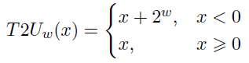
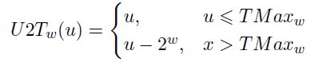

# 信息存储
## 1. 一些基础概念
   1. 位：0或1
   2. 溢出：计算机只以有限的位表示数字，如果结果太大超过了位的表示，就会产生溢出
   3. 由于计算机精度有限，浮点运算是不可结合的
   4. 字节：最小的可寻址内存单位，计算机无法直接访问位，最小只能访问到字节。一般8bit=1byte
   
   5. 程序将内存视为一个非常大的数组，称为虚拟内存。
   6. 地址：内存的每一个字节均由一个唯一的数字标识，称为（虚拟）内存的地址。这些所有的地址的集合就称为虚拟地址空间
## 2. 十六进制
1. 一般简写为hex
2. 0~9和A~F代表16个可能的值
3. C语言中以0x或者0X开头标识十六进制。表示16进制时，A和F可以不用大写，可以大小写混写
4. 转换窍门：
   1. 十六进制转换成二进制：将十六进制每个数字转换成二进制，并且拼接成一个整数字串
   
   2. 二进制转16进制：从右至左，每四个数字为一组，最左侧的一组可能不足4个数字，用0在左侧补足即可
   
   3. 十进制转二进制：
      1. 当$x=2^n$，此时x可以简单写成二进制，为1后面跟着n个0;
      2. 或者直接疯狂除2，方法类似十进制转16进制中的第二个方法
   4. 十进制转16进制：
      1. 如果$x=2^n$，那么有n=i+4j，则转成16进制时首个数字为$2^i$，首个数字后紧跟j个0。比如$2048=2^11$，则$n=11=3+4*2$，从而16进制表示为：0x800
      2. 用数字除以16，得到商q和余数r。r为16进制最低位数字，然后q反复执行这个过程，可以得到16进制的数字：
      
   5. 任意进制转10进制：比如有一个由$a_1$为最高位的n位的16进制数字，那么就为$a_1 * 16^{n-1}*……*a_i * 16^0$
## 3. 字
1. 每台计算机都有一个字长，知名指针数据的大小。
2. 虚拟地址以这样的一个字进行编码。字长决定了虚拟地址空间最大值。
3. 32位程序与64位程序的区别在于编译时采用多少位大小的字长，而非运行机器的类型
4. 64位的字长为64bit，也就是说一般使用8字节地址；32位系统一般使用4字节地址

## 4. 寻址与字节顺序
1. 多字节对象一般被储存为连续的字节序列，对象的地址为所用字节中最小的地址。比如int32 x，4个字节为0x100、0x101、0x102、0x103，但是x的地址为0x100
2. 大端法：最高有效字节存储在最前面，也就是低地址处。你可以把它看成是一种正序存储
3. 小端法：最低有效字节存储在在最前面，你可以理解为一种逆序存储

4. 在上面的例子中，x为一个int，十六进制为0x01234567。一个字最多只能装2个16进制数字，因为一个字如果是8bit，那么10进制取值范围为0~255，那么FF已经是可以达到的最大值
5. 具体使用什么端，要看系统设计。两种都很流行。现在甚至还有双端操作系统，即人工手动设定到底采用小端还是大端

## 5. 表示字符串
1. C语言中，字符串被编码为NULL 字符（值为0）结尾的字符数组，每个字符都由某个标准编码来进行表示，最常见的是ASCII

2. 十进制阿拉伯数字0~9的ASCII码都是0x3i，i为对应的数字。比如十进制数字9的ascii是0x39。字符串最后必以00终止（即null）。因此字符串“12345”的16进制码为 31 32 33 34 35 00.</br>
3. 使用ascii码表示字符串在任何系统上结果相同，因此文本数据比二进制数据具有更强的平台独立性

## 6. 位运算
1. 与非或异或：
<br>
非：$\neg$<br>
与：$\land$<br>
或：$\lor$<br>
异或：$\bigoplus$，P和Q为真但是不能同时为真
2. 位向量运算：两个等长的，由01构成的向量进行布尔运算，例子如下：

3. “与”对“或”满足分配率，“或”也对“与”满足分配率
4. 加法逆元：值x，存在一个值-x使得，x+(-x)=0，那么-x称为加法逆元
5. 布尔环：长度为w的位向量进行非、异或、与运算时，可以形成布尔环。布尔环中，用全0的位向量表示0。那么加法运算为异或，此时任何值a的加法逆元为自己。并且布尔环中，加法满足结合律(a^b)^a=0
6. 位向量表示有限集合：<br>
   1. 有全集$U={0,1,...,w-1}$，A为全集U的子集，w为位向量长度根据具体集合。比如给定所有集合中最大元素为8，那么w就设定为9
   2. 位向量：$[a_{w-1},...,a_1,a_0]$。如果$i \in A$，那么$a_i=1$。比如$S={0,1}$,那么位向量表示为$[011]$
   3. |对于集合运算的并，&对应交，~对应补。比如$A={0,3,5,6}$,有位向量$a=[01101001]$;$B={0,2,4,6}$,有位向量 $b=[01010101]$。A和B的交集为 A&B，位向量为[01000001]

## 7. C语言中的高级运算
1. 位运算
   1. 位运算有非、与、或、异或四种
   2. 对于一个表达式的布尔运算结果最好方法就是把数值转换成二进制，执行二进制运算后再转回16进制
   
   1. 掩码运算：
      1. 提取最低有效字节的掩码运算：<br>
      x=0x89ABCDEF,x&0xFF=0x000000EF。其中，0xFF就是我们所说的最低有效字节掩码
      1. ~0意思为生成一个全为1的掩码
2. 逻辑运算：
   1. 逻辑运算符：
      1. OR：||
      2. AND：&&
      3. NOT：！
   2. 逻辑运算与位运算的区分：
      1. 逻辑运算认为非0参数都是true，参数0是false：。但是位运算的求解结果明显与这个是不同的
      2. 逻辑运算符&&和||，如果第一个参数求值就能得出结果，那么逻辑运算符就不会管第二个参数求值。比如：a&&b，如果a是false，那么不会判断b的正确性。所以if(a && 5/a)这条语句在a=0时依然成立，不会有5/0的计算
3. 移位运算：
   1. 移位运算时从左至右可结合的，`x<<j<<k`等价于`(x<<j)<<k`
   2. 左移：`<<` </br>
   一个变量x的位表示为$[x_{w-1},...,w_1,w_0]$，进行左移k位`x<<k`，就有[x_{w-k-1},x_{w-k-2},...,x_0,...,0]。左移会将最高的k位全部舍弃，并在最后的k位补0。<br>
   k的区间值为$0~w-1$
   3. 右移：`>>`
      1. 逻辑右移：右移k位后，在最左端k位补0
      2. 算术右移：右移k位后，在最左端k位补上k个$x_{w-1}$
      3. C语言标准没有规定哪种右移方式，但是一般编译器对于**有符号数**采用算数右移，**无符号数**采用逻辑右移
      4. java对于右移有明确定义。`x>>>k`表示逻辑右移，`x>>k`表示算数右移
   4. 例子：斜体就是我们补得位<br>
   5. 如果$k \ge w$会发生什么:
      1. 移位指令会执行`k mod w`大小的位移量
      2. C语言程序不一定有这种执行，所以尽量不要这样做
      3. 例子:<br>
      
   6. 移位操作的优先级：移位操作优先级往往比普通运算低。比如`1<<2+3<<4`，计算机会理解为`(1<<(2+3))<<4`，而不是`(1<<2)+(3<<4)`

# 整数
## 1. 正负号的表示
1. 在有符号数据类型的整型数据中，负数也就是下界的绝对值比上界大1<br>

2. 在C语言最低标准中，我们要求除了像int32这种规定大小的数据类型外，其余数据类型均满足对称要求。并且int可以用2个字节，long可以用4个字节实现
3. 正负号表示
   1. 真值：带有正负号的二进制数
   2. 在计算机中约定: 在有符号数的前面增加1位符号位，用0表示正号，用1表示负号
   3. 机器数：种在计算机中用0和1表示正负号的数
   4. 正负号表示的三种形式
      1. 原码：
         1. 正数符号位用0表示，负数符号位用1表示
         2. X=+1010110，那么$[x]_{原}=01010110$
         3. 0的原码不唯一，可以是$[+0]_{原}=00000000$，也可是$[-0]_{原}=10000000$
         4. 原码的问题：原码处理加减法会很困难
            1. 比如000000001+10000000=10000010，就会得出1+(-1)=-2的奇怪结论
            2. 而且原码计算如果同号数字相减，且为小数减大数，处理起来也很麻烦
            3. 因此在原码计算中，符号位不能直接参与运算，这加重了计算机的开销
      2. 反码
         1. 正数还是按照原码方式表示，负数在保留符号位不变的情况下对原码取反
         2. 比如x=-1010110,那么$[x]_{原}=10110101$，$[x]_{反}=11001010$
         3. 在这种情况下，0还是有两种表示方式
      3. 补码
         1. 正数：与原码相同
         2. 负数：在反码的基础上再+1
         3. 比如x=-1010110,$[x]_{补}=11001010+1=11001011$
         4. $[[x]_{补}]_{补}=[x]_{原}$
         5. 在补码中，无论是+0，还是-0，他们的表示形式都是00000000
         6. 补码原理：
            1. 使两个二进制数相加为0。比如在4位整型下，5的原码是0101，如果我们能找到一个二进制数与5相加为10000，那么最高位1会因为溢出而变成0000而达成两数之和为0的效果
            2. 要+1，主要是为了弥补反码的不足。反码-5=1010，5=0101，相加为1111，不是0000
            3. 补码这种方式可以直接求得对应的十进制数字，比如$[1010]_2=-2^3+0*2^2+1*2^1+0*2^0=-5$
            4. 为什么上界一般比下界小1：以一个字节(8bit)长度为例。因为在补码体系中，最小的数字为$[1000 0000]_2=-128$，但是最大数字为$[0111 1111]_2=127$
            5. 有符号数与无符号数补码的对应关系：<br>图中T表示有符号类型，U表示无符号类型</p>

## 2. 数据转化   
1. 有符号与无符号数的转换
   1. C 语言允许数据类型做强制转化。
   2. 我们应当避免大类型数据转向小类型数据，比如无符号转有符号就会出现很大的问题
   3. 有符号数转无符号数：
      1. 当有符号数的位向量最高位$x_{w-1}$为1，说明是负数。转向无符号数时需要在原x上加一个$2^w$
      2. 当$x_{w-1}$为0，说明是正数，转换后数字不变
      3. 用T2U表示有符号数到无符号数的映射：
      
   4. 无符号转有符号：
      1. 用u表示原本的无符号情况下的十进制数字，取值范围为$[0,U_{max}]$,此时有如下关系：
      
      1. 当最高位等于0 时，无符号数可以表示的数值小于有符号数的最大值，此时转换后的数值不变。
      2. 当最高位等于1时，无符号数可以表示的数值大于有符号数的最大值，在这种情况下，转换后得到有符号数等于该无符号数减去$2^w$
   5. C语言中，如果运算数一个有符号，一个无符号，那么C语言会将有符号数隐式强制转换成无符号数。例子如下：
   ```
   int i = -1;
   unsigned int b = 0;
   if (a < b){
      printf ("-1"<0);
   }
   else{
      printf ("-1>0");
   }
   ```
   这个代码输出会是"-1>0"。因为i被强制转成无符号，为(unsigned) i = $2^32+(-1)$

2. 拓展一个数字的位表示
   1. 当小型数据类型转向打数据类型，就需要进行位拓展
   2. 零拓展：<br>主要用于无符号数的拓展。比如把unsigned char 转成unsigned short，前者8位，后者16位。因此在转换时直接在前补0：
   
   3. 符号拓展<br>：
   当一个有符号数进行大数据类型转化，直接根据符号进行补位。比如说是一个负数，那么就是在前面补1
   
   4. 转换定理：当有符号数从一个较小的数据类型转换成较大类型时，进行符号位扩展，可以保持数值不变<br>证明如下：<br>我们先证明$B2T_{W+1}([X_{W-1},X_{W-1},X_{W-2},...,X_0])=B2T_{W}([X_{W-1},X_{W-2},...,X_0])$，然后用数学归纳法可以得到$B2T_{W+k}=B2T_W$<br>
   </p>    
3. 截断:
   1. 如果我们把一个大数据类型转成小数据类型，就会发生截断
   2. 对无符号数截断：
      1. 将一个w 位的无符号数，截断成k位时，丢弃最高的w-k位，截断操作可以对应于取模运算，即除以2的k次方之后得到的余数
      2. 推导：<br>
      
   3. 有符号数的截断:
      1. 假设要截断成k位，先将数字转换成无符号数，使用与无符号数相同的截断方式，得到最低K位
      2. 我们将第一步得到的无符号数转换成有符号数
      3. 例子：<br>
      将32位int x = 53191转成16位的short，说明截断了16位。x转成无符号数仍为53191，于是$(unsigned)x mod 2^{16}=(unsigned)x$, $(short) x = x - 2^{16}$
   4.  一个建议：尽量不要在算数计算中去使用无符号数，

## 3. 整数的运算
1. 无符号加法：
   1. 溢出可以看成是一种无符号的截断。可以先计算结果，然后进行截断处理
   2. 比如x=9=[1001]，y=12=[1100]，x+y=21=[10101]，x+y是5位，超过了4位，因此实质上x+y=[0101]=5
   3. 规律：$+^u_{w}$定义为x和y的无符号数的w位截断加法，并且可能发生溢出<br>
   
   4. 溢出判断：
   
   5. 无符号求非：对于任意无符号数，如果有$-^{u}_{w}x+^{u}_{w}x=0$，那么我们认为$-^{u}_{w}x$为x的逆元（针对位的），也就是无符号数求反<br><br>这个推导可以理解为一个加法运算后，为了判断在w长度的范围内是否为0，于是对数字进行w位长的截断
2. 有符号数加法（有符号数中负数的运算）：
   1. 原理：<br>
   
      1. $+^t_{w}$定义为有符号数加法，并且截断数为w
      2. 当x加y的和大于等于$2^{w−1}$时，发生正溢出，此时，得到的结果会减去$2^w$。</br>这个转换主要来自于无符号数到有符号数转换的公式，如果超出范围，需要我们$-2^w$
      3. 当x加y的和小于$−2^{w−1}$时，发生负溢出，此时，得到的结果会加上$2^w$。</br> 因为原本x+y的结果是在$x_w$这个位置有1的，但是因为我们的位向量中最高位是$x_{w-1}$，因此需要将$x_w$位的1舍掉，即减去$-2^w$
   2. 检测溢出：
      1. 正溢出：当x和y均大于0，但是它们的和s小于等于0
      2. 负溢出：当x和y均小于0，但是它们的和s大于等于0 
   3. 有符号的非：<br>
   
3. 无符号乘法：<br>

4. 有符号乘法<br>
   1. 先将数字的位视为无符号数处理，然后将结果转化为有符号数
   2. 编译器优化：常数的乘法运算使用“移位+加法”的组合进行等价替换
      1. 移位运算可能会导致溢出
      2. 乘$2^n$：有无符号数值k$(0\leq k <w)$，有整型数字x，那么$x*2^k=x<<k$
         1. 推导：<br>
         
         2. 其他数字的乘法我们就通过对于$2^n$的运算进行实现。比如$14=2^3+2^2+2^1=2^4-2^1$，那么$x*14=x<<3+x<<2+x<<1=(x<<4)-(x<<1)$
      3. 除$2^n$：有无符号数值k$(0\leq k <w)$，有整型数字x，那么$x*2^k=x>>k$，数值结果为$[x/2^k]$。

         1. 位移时，如果是无符号数，左侧空位填0
         2. 如果是有符号数，左侧空位填符号数
         3. 舍入的问题：<br>
         这种操作只会向下舍入，但是如果x是负数，我们往往希望它是向0方向舍入。
         比如如果结果是-771.25，那么这种除法操作方法结果就是-772，但是我们可能希望他是-771
         4. 如果想要向上舍入，就需要进行：$(x+(1<<k)-1)>>k$。推导如下:
         
         这里要注意，r属于正整数，因此如果大于0，那么至少r=1
         5. 因此，除法具体运算如下：
         
         6. 除以$2^n$无法扩展到任意常数，因此应用范围不及乘法

# 浮点数
## 1. 定点表示法：
1. 十进制表示：$d = \sum^m_{i=-n} 2^i \times d_i$，$d_i=\{0,1\}$
2. 二进制表示：$b = \sum^m_{i=-n} 2^i \times b_i$，$b_i=\{0,1\}$<br>

2. 这种表示方法很难精确表示$\frac{1}{3}$这种难以使用$x\times2^y$表示的数字，只能去近似表示
## 2. IEEE浮点数表示
1. 形式：$V = (−1)^s \times M\times 2^E$
   1. 符号：符号由s决定
   2. 尾数：M是一个二进制小数,具体范围根据浮点数的数值而定。
   3. 阶码：$2^E$对浮点数加权
2. float在系统中的结构：C语言中，float占4字节，32bit，分为3个字段
   1. 示意图：
   
   1. 第31位为s。s=0，浮点数为正；s=1，浮点数为负
   2. 23到30位，也就是8个bit长度存储E，
   3. 剩余的23位与尾数M相关。
      1. 每一个单元就是一个f。比如如果小数位为3，那么0000 0001就表示为$\frac{1}{2^{3}}$（非规格化的数）或者$\frac{1}{2^{3}}+1$（规格化的值）
      2. 0000 0010位$\frac{2}{2^{3}}$
3. double的结构：一共64位，和float最大的区别在于M部分和E部分的长度<br>
4. 浮点数的数值：由阶码决定
   1. 规格化的值：当阶码二进制位不全为0且不全为1时
      1. 我们以float为例。用e表示8位的二进制数，那么取值范围是$[1,254]$<br>
      2. 阶码E的值并不等于e所表示的值，而是$E=e-bias$。$bias=2^{k-1}-1$，即bias的值与阶码字段的位数相关
      3. M的范围是$1\sim2-\epsilon$，即1~2之间的小数。$M=1+f=1+f_{n-1}...f_{1}f_0$
   2. 非规格化的值：当阶码的二进制位全为0
      1. 浮点数也分正0和负0，二者一般而言等价。负0就是除了s=1，其他位置都是0.正0则符号位是0，其他地方均为0。
      2. 可以表示非常接近0的数。此时$E=1-bias$,M会成为$0 \sim 1$的小数。$bias=2^k-1$k为阶码数。比如说如果阶码长度为8，那么E=-7
      3. $M=f=f_{n-1}...f_{1}f_0$
      4. 为什么定义$E=1-bias$而不是$E=-bias$：为保证小数的平滑过渡。我们的非规格化数主要是为了表示很靠近0的数值，这就表示我们需要和规格化数去进行衔接。但是规格化数M包含1，而非规格化数没有，所以我们安排一个$2^1$弥补这一部分问题
   3. 特殊值：
      1. 无穷大：E全1，M全0
         1. 正无穷：s=0
         2. 负无穷：s=1
      2. NaN：E全1，但是M部分不为0
   4. 这些特殊的规定都是为了保证浮点数的二进制形式按顺序排列正好满足他们转换成10进制形式的顺序
   5. 一些极端值的表示：<br>
      1. 最大非规格化数的M部分虽然如果按照我们前面的推论，应该是1，但是非规格化数的M部分实际上很难到底1，而是极其逼近1的数值
      2. 非规格化数的阶数部分因为全是0，所以恒定不变
## 3.整型转单精度浮点
1. int 12,345的二进制为·0000 0000 0000 0000 0011 0000 0011 1001`
2. 只看最后14位：$12,345 = 1.1000000111001 \times 2^13$
3. 此时只看小数部分。因为float的E部分是8bit，bias为127。E=e-bias，所以$13=e-127 \rightarrow$ e=140=1000 1100
4. 此时生成float表示为：


## 4.舍入：IEEE浮点格式要求
1. 向偶数舍入：使最低有效数字是偶数
   1. 10进制而言，记住“四舍六入五凑偶”。即只有数字位于两个数字中间时才会考虑凑偶数。比如说2.5，我们要只保留整数，2.5在2和3中间，那么就会取2而不是3。但是如果是2.6只保留整数，那么就是3了
   2. 保留位：近似结果的最低位。如果想保留两位小数，那么保留位就是百分位
   3. 近似位：保留位的下一个位，也是第一个被舍弃的位。比如保留两位小数，近似位就是千分位
   4. 粘滞位：近似位后面所有位
   5. 中间值的求法：
      1. 保留位：和左边的数字保持不变；
      2. 近似位：改写为N/2（N为进制数，十进制就是10，二进制就是2）
      3. 粘滞位：全部写零
      4. 比如1.36，保留1位小数，那么只留1.3，然后后面接5。因此，中间值就是1.35。按照向偶数舍入的方法，1.36大于1.35，所以1.35直接向前进，变成1.4
      5. 二进制下，如果保留1位小数。有1.111，他的中间值是1.11，原值大于中间值，因此中间值前进，保留结果为10.0
   6. 更加通俗的规则：
      1. 如果最接近的值唯一，则直接向最接近的值舍入
      2. 如果是处在“中间值”，那么要看保留位(Guard bit)是否是偶数，如果是偶数则直接舍去后面的数不进位，如果是奇数则进位后再舍去后面的数。
2. 向0舍入：朝向0的方向舍入。整数向下舍，负数向上舍
3. 向下舍入：向小的方向舍入
4. 向上舍入：向打的方向舍入

## 5. 浮点运算
1. 加法
   1. 规则：<br>
   <br>
   如果$M\ge2$,M右移直到小于2，然后E部分扩大相应的值<br>如果$M>1$,M左移直到大于等于1，然后E部分缩小相应的值<br>如果E超出范围，浮点数会发生溢出，数字变成无穷大<br>M会进行一些舍入规则使其满足float位数保留要求
   2. 定义$+^f$为阿贝尔群中的加法。我们一般认为浮点数运算满足阿贝尔群
   3. 特殊值的计算：
      1. IEEE规定：$-1/0=-\infty$，$1/0=\infty$
      2. $NaN+^fx=NaN$，x可以是任何值
   4. 浮点数加法相较于无符号和补码加法而言，可以保证加法的单调性。比如$a \leq b$，那么除了NaN或者无穷大，均有$x + a \leq x+b$  
   5. 浮点数加法缺乏结合性：浮点数加法会对结果进行一些舍入处理，这可能会导致计算错误
   <br>(3.14 + 1e10) − 1e10 = 0.0
   <br>3.14 + (1e10 − 1e10) = 3.14
2. 乘法
   1. 规则：<br>
   <br>
   如果$M\ge2$,M右移直到小于2，然后E部分扩大相应的值<br>如果E超出范围，浮点数会发生溢出，数字变成无穷大<br>M会进行一些舍入规则使其满足float位数保留要求
   2. 浮点数乘法也和加法一样，也满足阿贝尔群，也会对结果进行舍入处理。但是由于存在溢出和舍入失去精度的问题，它不具有结合性：<br>(1e20 ∗ 1e20) ∗ 1e − 20 = +∞<br>1e20 ∗ (1e20 ∗ 1e − 20) = 1e20<br>同时，也不具有分配性：<br>1e20 ∗ (1e20 − 1e20) = 0.0<br>1e20 ∗ 1e20 − 1e20 ∗ 1e20 = NaN
   3. 乘法的单调性特点：
      1. 存在a、b、c，他们都不是NaN或者无穷大，那么有如下单调性规律：<br>$a \ge b$且$c\ge 0 \rightarrow a *^f c\ge b*^f c$<br>$a \ge b$且$c\le 0 \rightarrow a *^f c\le b*^f c$
      2. 只要$a\neq 0$，就有$a*^fa\ge0$
3. C语言中的浮点数
   1. int转float，不会发生溢出，但是会发生舍入，因为小数字段只有23位，但是int有32位。double就不会出现这种情况
   2. double转float，可能发生溢出，变成无穷大。而且float精度更小，会发生舍入
   3. float与double转int，值会被向0舍入，也可能会因为太大发生溢出  