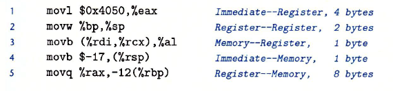

# 程序的机器级表示
1. 指令集架构（ISA，又称指令集体系结构）：定义机器级程序的格式和行为
2. 虚拟地址：机器级程序使用的内存地址都是虚拟地址，内存会被模拟成一个巨大的字节数组
3. linux上的指令：
   1. `gcc -Og -o prog main.c mstore.c`<br>
   编译选项og用来告诉编译器生成符合原始C代码的机器代码。如果想要更高性能，可以换用-O1或-O2，但是会导致机器代码变得极为抽象而难以理解<br>-o prog为生成可执行文件prog<br>
   1. `gcc -Og -S mstore.c`<br>生成汇编文件mstore.s<br><br>以.开头的行都是指导汇编器和链接器工作的伪指令，完全可以忽略。删除后，剩余汇编代码与源文件中代码是相关的。<br>
      1. pushq：将%rbx值压入栈
      2. popq：将%rbx弹出栈，恢复rbx
      3. 因为是mulstore这个函数自身去做保存，所以我们可以推知这个处理器采用调用者寄存器这个策略（这个部分请看[寄存器中的2](#register))
      4. moveq：将rdx中的内容复制到rbx
      5. 寄存器定义函数mulstore中的x、y和dest分别指向rdi、rsi和rdx。具体见[寄存器中的3](#change)
      6. call 调用函数，结果保存在rax
      7. ret：即函数返回，表示函数结束
      8. 汇编指令最后的q和数据有关，详见[数据格式](#数据格式)。q只是表示大小指示符，大多数情况下可省略
   2. `gcc -Og -c mstore.c`<br>生成目标代码文件mstore.o，是二进制格式
   3. `objdump -d mstore.o`<br>对二进制文件进行反汇编，去将其转换成对应的汇编语言。objdump可以将机器代码等进行反汇编为汇编语言
   4. `objdump -d prog`<br>对prog这个可执行文件进行反汇编
# 数据格式
1. Intel用术语“字（word）”表示16位类型，32位为双字，64位为4字。这些不同的数据类型决定了汇编代码后缀的不同:<br>
2.move指令的四个变种：moveb，传送字节；movw，传送字；movel，传送双字；moveq，传送四字
# 寄存器
   1. 寄存器：<br>
   2. <a name="register">调用者保存寄存器和被调用者保存寄存器</a>
      1. 问题来源：<br><br>其中，A为调用者（“主调函数”），B为被调用者（“被调函数”）<br>在执行中，我们不难发现，函数B会对%rbx中的内容进行修改，但是实际上函数就是函数，他不应该在A里面对%rbx这个位置的内容做任何变动，所以我们需要对这个位置的数值进行保护
      2. 调用者寄存器：函数A在调用函数B之前，提前保存寄存器rbx的内容，执行完函数B之后，再恢复寄存器rbx 原来存储的内容，这种策略就称之为调用者保存：<br>
      
      3. 被调用者寄存器：函数B在使用寄存器rbx之前，先保存寄存器rbx的值，在函数B返回之前，先恢复寄存器rbx原来存储的内容，这种策略被称之为被调用者保存：<br>
      
      4. 不同的处理器才用的调用者策略采用不同
   3. <a name="change">寄存器的演变</a>：<br>
      1. x86-64的CPU使用了16个存储64位值的通用目的寄存器，这些寄存器用来存放整数数据与指针
      2. 前8个处理器由于历史原因，命名方法与后8个不同。后8个采用的是新命名方法
      3. 最里层只能访问最低的1个字节。%ax这一层为16位寄存器，可以访问最低的两个字节。%eax这一层为32位寄存器，可以访问最低的4个字节。而最外层可以访问整个寄存器
      4. 寄存器rsp 用来保存程序栈的结束位置
# 操作指令
1. 指令包含两部分：操作码和操作数。movq一类，属于操作码，他决定了CPU执行操作的类型。操作码后面的部分是操作数。
2. 指令一般是1个操作码，多个操作数。但是ret没有操作数：<br>
3. 操作数
   1. 立即数：用来表示常数值，书写方式为‘$’+标准C表示法表示的整数，比如$-577.不同的指令允许的立即数值范围不同。汇编器会自动选择最紧凑的方式进行数值编码
   2. 寄存器：表示某个寄存器的内容，可以引用8、16、32、64位的寄存器都可以作为操作数。表示形式见[寄存器](#寄存器)
   3. 内存引用：
      1. 我们一般将内存视为一个大数组，因此我们表示内存引用，需要目的数据的起始地址addr和数据长度d。记为符号$M_b[addr]$，b一般可以省略
      2. 寄存器带小括号，表示内存引用。比如`(%rax)`
      3. 内存引用的表示：$Imm(r_b,r_i,s)$
         1. Imm：立即数
         2. $r_b$：基址寄存器
         3. $r_i$：变址寄存器
         4. s：比例因子，取值为{1,2,4,8}。具体取什么数值和源代码中定义的数组类型有关，编译器根据数组的类型决定比例因子的数值。比如char的比例因子为1，int为4
         5. 有效地址：有效地址是通过立即数与基址寄存器的值相加，再加上变址寄存器与比例因子的乘积，即$Imm(r_b, r_i, s) → Imm + R[r_b] + R[r_i] · s$
   4. <a name = "form">操作数的格式(寻址操作)汇总</a>：<br><br>比如在%rbx这个操作数而言，就是表中$r_a$可以取的值。而$(r_a)$就是一种内存引用的表示<br>储存器也就是我们所说的内存引用<br>这里是一些操作数的例子：<br> 
4. mov指令：
   1. 效果定义：`mov S D`，意思为$D \leftarrow S$
   2. 分为movb、movw、movl、movq四个子命令，传输1、2、4、8字节
   3. 传送指令有两个操作数，第一个是原操作数、第二个是目的操作数
      1. 源操作数：可以是立即数、寄存器或者内存地址
      2. 目的操作数：只能是寄存器，要么是一个内存地址，不可以是一个立即数
      3. x86-64处理器限制，mov指令的源操作数和目的操作数不能都是内存的地址。如果一个数需要从内存一个位置复制到另一个位置，需要用两条mov完成：
      ```
      mov memory, register
      mov register, memory
      ```
      1. mov的后缀一定要和寄存器的大小匹配，比如%eax是32位寄存器的表示，所以要使用movl。`movl $0x4050, %eax`，下图是源操作数与目的操作数的所有组合形式的例子：<br>
   4. movabsq：
      1. 当movq的源操作数为立即数，他只能是32位的补码表示。我们需要对该32位数进行符号拓展，拓展为64位然后传输到目标位置。
      2. 如果我们想要操作64位数字，使用movabsq。movabsq的源操作数可以是任意64位数，**但是目的操作数只能是寄存器**
   5. mov这几种指令的具体传输过程
      1. 例子：<br>
      2. movabsq：直接将64位数字写入
      3. movb：只改变rax寄存器中8bit部分，-1表示成1字节就是FF
      4. movw：和movb同理，只改变16bit部分
      5. movl：改变最低4字节长度的数值，并且将前面4字节全部变0。这种全变成0的操作只有目的操作数为寄存器时才会执行。**这是x86-64 处理器的一个规定，即任何位寄存器生成32位值的指令都会把该寄存器的高位部分置为0**
      6. movq：其实只改变了最后4位部分为F，剩下的F都是符号拓展，因为我们输入的是-1，他的符号拓展在二进制中全是1，所以16进制下都是F
   6. 源操作数小于目的操作数时的mov指令
      1. 零拓展指令（movz）：即目的操作数的空位由0补齐<br>
      2. 符号拓展指令(movs)：目的操作数空位由符号扩展填充<br>cltq没有操作数，他总是以寄存器%eax为源，%rax为目的数，效果等价于`movslq %eax, %rax`
      3. 为什么零拓展没有类似movslq这种4字节拓展到8字节的操作：因为使用movl即可实现。4字节值以寄存器为目的的指令，会将高4字节值全部设置为0(这是x86-64的规定，详见movl部分的解释)。因此没有必要为4字节转8字节单独设立指令
   7. 数据传输的示例：
      1. 代码:<br>
      ```
      int main(){
         long a = 4;
         long b = exchange (&a, 3);
         printf(”a = %1d , b = %1d\n”, a, b);
         return 0;
         }
      
      long exchange(long *xp , long y){
         long x = *xp;
         *xp = y;
         return x;
      }
      ```
      1. exchange的机器指令拆解：其中，xp作为第一个参数，在%rdi中，y作为第二个参数，在%rsi中
      ```
      exchange:
         movq (%rdi), %rax
         movq %rsi, (%rdi)
         ret
      ```
         1. 第一个movq：从内存读取数据到寄存器<br>为memory到register的命令，因为x为返回数，所以x的寄存器位置为%rax。第一步将xp的内存地址复制到x的寄存器中，即读取xp的数据
         2. 第二个movq：将寄存器数据写至内存<br>为register到memory
         3. C 语言中所谓的指针其实就是地址。
         4. 局部变量一般保存在寄存器中，而不是内存中。比如例子中的xp和x。C语言这样优化可以加快访问速度
         5. 这个例子中，因为根据寄存器规则，两个函数的参数会被写入寄存器以实现快速访问。但是xp是指针变量，它本身是地址，是一种间接寻址。因此如果想要获取数据，根据寄存器规则要回到内存找到数据。但是y是一种绝对寻址，因此不用加括号。具体可以见"操作指令3.4"的[表格](#form)
5. 栈操作下的数据传输指令
   1. 栈的增长方向是从高地址向低地址，栈顶的元素是所有栈中元素地址中最低的。根据惯例，栈是倒过来画的，栈顶在图的底部，栈底在顶部。
   2. 栈的寄存器位置为rsp
   3. 压栈：push
      1. 如果压%rax中的数据，操作为:`pushq %rax`
      2. 这个指令可以拆解为两步：
      ```
      subq $8, %rsp
      movq %rax, (%rsp)
      ```
      因为%rax位置为8字节数，所以，第一步先将栈指针%rsp减8，让其指向更低的位置（也就是指针像栈顶部移动），然后将rax的值复制到rsp指向的新位置<br>
      
   4. 弹出栈：pop
      1. `popq %rax`
      2. 这个操作等价于：
      ```
      movq (%rsp), %rax
      addq $8, %rsp
      ```
      1. 实际上pop 指令是通过修改栈顶指针所指向的内存地址来实现数据删除的，此时，内存地址0x100 内所保存的数据0x123仍然存在，直到下次push 操作，此处保存的数值才会被覆盖<br>

# 算数和逻辑操作
1. 加载有效地址：leaq
   1. 效果定义：`leaq S,D`，$D \leftarrow &S$
   2. leaq是movq的变形，主要作用是加载有效地址，效果是读内存数据到寄存器。因此，目标操作数必须是寄存器，源操作数必须是内存引用(memory)。
   3. 和mov的区别：
      1. lea 8(%ebx), eax就是将ebx+8这个值直接赋给eax，而不是把ebx+8处的内存地址里的数据赋给eax
      2. mov 8(%ebx), eax则是把内存地址为ebx+8处的数据赋给eax
   4. 在x86-64上，地址均为64位，因此没有leab、leaw这类命令
   5. 表示加法与有限的乘法运算：
      1. `leaq 7(%rdx,%rdx,4),%rax`
      假设寄存器rdx 内保存的数值为x，那么有效地址的值为7 + %rdx + %rdx * 4 = 7+ 5x。
      2. 有函数：<br>
      ```
      long scale(long x, long y, long z){
         long t = x + 4 * y + 12 * z;
         return t;
         }
      ```
      它的编译形式为：
      ```
      scale:
         leaq (%rdi, %rsi, 4), %rax
         leaq (%rdx, %rdx, 2), %rdx
         leaq (%rax, %rdx, 4), %rax
         ret
      ```
      为什么12\*z要拆成4*(3*z)?因为比例因子只能取1,2,4,8。这里如果写成12*z，那么就会变成(%rax, %rdx, 12)，比例因子是12，不符合要求
2. 一元操作
   1. 只有一个操作数，既是源，也是目的：<br>
   2. 操作数可以是寄存器或者内存地址(memory)
3. 二元操作
   1. 第一个操作数为源操作数，第二个操作数既是源操作数，又是目的操作数
   2. 源操作数可以是立即数、寄存器或者内存地址；第二个操作数可以是寄存器或者内存地址：<br>
   3. 如果第二个操作数为内存地址，处理器需要从内存读出值，再执行操作
   4. 一元操作和二元操作的例子：<br>该图为一开始的数据以及后续操作：<br>
      1. addq：相加命令，改变的是%rax的内存位置，因此rax本身不变，但是0x100处的数据由0xFF变为0x100
      2. subq：相减命令，改变的是%rax地址+8位处的地址，也就是0x108处的数据，操作之后，0xAB变为0xA8
      3. incq：自身+1命令，改变的仍是内存位置的数据，0x13变成0x14
      4. subq：相减命令，但是改变的是rax在寄存器中的数据而不是地址位置，0x100变成0xFD<br>
4. 移位
   1. 第一个操作数为移位量，第二项给出的是要移位的数：<br>
      1. 左移指令两个效果相同，都是左移后在右侧补0
      2. 算数右移：左侧填符号位
      3. 逻辑右移：左侧补0
   2. 移位量k：可以是立即数或者存放在寄存器cl中的数
      1. cl长度为8bit，因此理论上位移量最大为$2^8-1=255$