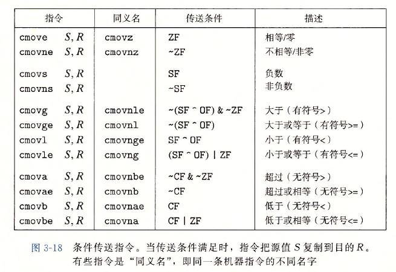

# 程序的机器级表示
1. 指令集架构（ISA，又称指令集体系结构）：定义机器级程序的格式和行为
2. 虚拟地址：机器级程序使用的内存地址都是虚拟地址，内存会被模拟成一个巨大的字节数组
3. linux上的指令：
   1. `gcc -Og -o prog main.c mstore.c`<br>
   编译选项og用来告诉编译器生成符合原始C代码的机器代码。如果想要更高性能，可以换用-O1或-O2，但是会导致机器代码变得极为抽象而难以理解<br>-o prog为生成可执行文件prog<br>
   1. `gcc -Og -S mstore.c`<br>生成汇编文件mstore.s<br><br>以.开头的行都是指导汇编器和链接器工作的伪指令，完全可以忽略。删除后，剩余汇编代码与源文件中代码是相关的。<br>
      1. pushq：将%rbx值压入栈
      2. popq：将%rbx弹出栈，恢复rbx
      3. 因为是mulstore这个函数自身去做保存，所以我们可以推知这个处理器采用调用者寄存器这个策略（这个部分请看[寄存器中的2](#register))
      4. moveq：将rdx中的内容复制到rbx
      5. 寄存器定义函数mulstore中的x、y和dest分别指向rdi、rsi和rdx。具体见[寄存器中的3](#change)
      6. call 调用函数，结果保存在rax
      7. ret：即函数返回，表示函数结束
      8. 汇编指令最后的q和数据有关，详见[数据格式](#数据格式)。q只是表示大小指示符，大多数情况下可省略
   2. `gcc -Og -c mstore.c`<br>生成目标代码文件mstore.o，是二进制格式
   3. `objdump -d mstore.o`<br>对二进制文件进行反汇编，去将其转换成对应的汇编语言。objdump可以将机器代码等进行反汇编为汇编语言
   4. `objdump -d prog`<br>对prog这个可执行文件进行反汇编
# 数据格式
1. Intel用术语“字（word）”表示16位类型，32位为双字，64位为4字。这些不同的数据类型决定了汇编代码后缀的不同:<br>
2.move指令的四个变种：moveb，传送字节；movw，传送字；movel，传送双字；moveq，传送四字
# 寄存器
   1. 寄存器：<br>
   2. <a name="register">调用者保存寄存器和被调用者保存寄存器</a>
      1. 问题来源：<br><br>其中，A为调用者（“主调函数”），B为被调用者（“被调函数”）<br>在执行中，我们不难发现，函数B会对%rbx中的内容进行修改，但是实际上函数就是函数，他不应该在A里面对%rbx这个位置的内容做任何变动，所以我们需要对这个位置的数值进行保护
      2. 调用者寄存器：函数A在调用函数B之前，提前保存寄存器rbx的内容，执行完函数B之后，再恢复寄存器rbx 原来存储的内容，这种策略就称之为调用者保存：<br>
      
      3. 被调用者寄存器：函数B在使用寄存器rbx之前，先保存寄存器rbx的值，在函数B返回之前，先恢复寄存器rbx原来存储的内容，这种策略被称之为被调用者保存：<br>
      
      4. 不同的处理器才用的调用者策略采用不同
   3. <a name="change">寄存器的演变</a>：<br>
      1. x86-64的CPU使用了16个存储64位值的通用目的寄存器，这些寄存器用来存放整数数据与指针
      2. 前8个处理器由于历史原因，命名方法与后8个不同。后8个采用的是新命名方法
      3. 最里层只能访问最低的1个字节。%ax这一层为16位寄存器，可以访问最低的两个字节。%eax这一层为32位寄存器，可以访问最低的4个字节。而最外层可以访问整个寄存器
      4. 寄存器rsp 用来保存程序栈的结束位置
# 操作指令
1. 指令包含两部分：操作码和操作数。movq一类，属于操作码，他决定了CPU执行操作的类型。操作码后面的部分是操作数。
2. 指令一般是1个操作码，多个操作数。但是ret没有操作数：<br>
3. 操作数
   1. 立即数：用来表示常数值，书写方式为‘$’+标准C表示法表示的整数，比如$-577.不同的指令允许的立即数值范围不同。汇编器会自动选择最紧凑的方式进行数值编码
   2. 寄存器：表示某个寄存器的内容，可以引用8、16、32、64位的寄存器都可以作为操作数。表示形式见[寄存器](#寄存器)
   3. 内存引用：
      1. 我们一般将内存视为一个大数组，因此我们表示内存引用，需要目的数据的起始地址addr和数据长度d。记为符号$M_b[addr]$，b一般可以省略
      2. 寄存器带小括号，表示内存引用。比如`(%rax)`
      3. 内存引用的表示：$Imm(r_b,r_i,s)$
         1. Imm：立即数
         2. $r_b$：基址寄存器
         3. $r_i$：变址寄存器
         4. s：比例因子，取值为{1,2,4,8}。具体取什么数值和源代码中定义的数组类型有关，编译器根据数组的类型决定比例因子的数值。比如char的比例因子为1，int为4
         5. 有效地址：有效地址是通过立即数与基址寄存器的值相加，再加上变址寄存器与比例因子的乘积，即$Imm(r_b, r_i, s) → Imm + R[r_b] + R[r_i] · s$
   4. <a name = "form">操作数的格式(寻址操作)汇总</a>：<br><br>比如在%rbx这个操作数而言，就是表中$r_a$可以取的值。而$(r_a)$就是一种内存引用的表示<br>储存器也就是我们所说的内存引用<br>这里是一些操作数的例子：<br> 
4. mov指令：
   1. 效果定义：`mov S D`，意思为$D \leftarrow S$
   2. 分为movb、movw、movl、movq四个子命令，传输1、2、4、8字节
   3. 传送指令有两个操作数，第一个是原操作数、第二个是目的操作数
      1. 源操作数：可以是立即数、寄存器或者内存地址
      2. 目的操作数：只能是寄存器，要么是一个内存地址，不可以是一个立即数
      3. x86-64处理器限制，mov指令的源操作数和目的操作数不能都是内存的地址。如果一个数需要从内存一个位置复制到另一个位置，需要用两条mov完成：
      ```
      mov memory, register
      mov register, memory
      ```
      1. mov的后缀一定要和寄存器的大小匹配，比如%eax是32位寄存器的表示，所以要使用movl。`movl $0x4050, %eax`，下图是源操作数与目的操作数的所有组合形式的例子：<br>
   4. movabsq：
      1. 当movq的源操作数为立即数，他只能是32位的补码表示。我们需要对该32位数进行符号拓展，拓展为64位然后传输到目标位置。
      2. 如果我们想要操作64位数字，使用movabsq。movabsq的源操作数可以是任意64位数，**但是目的操作数只能是寄存器**
   5. mov这几种指令的具体传输过程
      1. 例子：<br>
      2. movabsq：直接将64位数字写入
      3. movb：只改变rax寄存器中8bit部分，-1表示成1字节就是FF
      4. movw：和movb同理，只改变16bit部分
      5. movl：改变最低4字节长度的数值，并且将前面4字节全部变0。这种全变成0的操作只有目的操作数为寄存器时才会执行。**这是x86-64 处理器的一个规定，即任何位寄存器生成32位值的指令都会把该寄存器的高位部分置为0**
      6. movq：其实只改变了最后4位部分为F，剩下的F都是符号拓展，因为我们输入的是-1，他的符号拓展在二进制中全是1，所以16进制下都是F
   6. 源操作数小于目的操作数时的mov指令
      1. 零拓展指令（movz）：即目的操作数的空位由0补齐<br>
      2. 符号拓展指令(movs)：目的操作数空位由符号扩展填充<br>cltq没有操作数，他总是以寄存器%eax为源，%rax为目的数，效果等价于`movslq %eax, %rax`
      3. 为什么零拓展没有类似movslq这种4字节拓展到8字节的操作：因为使用movl即可实现。4字节值以寄存器为目的的指令，会将高4字节值全部设置为0(这是x86-64的规定，详见movl部分的解释)。因此没有必要为4字节转8字节单独设立指令
   7. 数据传输的示例：
      1. 代码:<br>
      ```
      int main(){
         long a = 4;
         long b = exchange (&a, 3);
         printf(”a = %1d , b = %1d\n”, a, b);
         return 0;
         }
      
      long exchange(long *xp , long y){
         long x = *xp;
         *xp = y;
         return x;
      }
      ```
      1. exchange的机器指令拆解：其中，xp作为第一个参数，在%rdi中，y作为第二个参数，在%rsi中
      ```
      exchange:
         movq (%rdi), %rax
         movq %rsi, (%rdi)
         ret
      ```
         1. 第一个movq：从内存读取数据到寄存器<br>为memory到register的命令，因为x为返回数，所以x的寄存器位置为%rax。第一步将xp的内存地址复制到x的寄存器中，即读取xp的数据
         2. 第二个movq：将寄存器数据写至内存<br>为register到memory
         3. C 语言中所谓的指针其实就是地址。
         4. 局部变量一般保存在寄存器中，而不是内存中。比如例子中的xp和x。C语言这样优化可以加快访问速度
         5. 这个例子中，因为根据寄存器规则，两个函数的参数会被写入寄存器以实现快速访问。但是xp是指针变量，它本身是地址，是一种间接寻址。因此如果想要获取数据，根据寄存器规则要回到内存找到数据。但是y是一种绝对寻址，因此不用加括号。具体可以见"操作指令3.4"的[表格](#form)
5. 栈操作下的数据传输指令
   1. 栈的增长方向是从高地址向低地址，栈顶的元素是所有栈中元素地址中最低的。根据惯例，栈是倒过来画的，栈顶在图的底部，栈底在顶部。
   2. 栈的寄存器位置为rsp
   3. 压栈：push
      1. 如果压%rax中的数据，操作为:`pushq %rax`
      2. 这个指令可以拆解为两步：
      ```
      subq $8, %rsp
      movq %rax, (%rsp)
      ```
      因为%rax位置为8字节数，所以，第一步先将栈指针%rsp减8，让其指向更低的位置（也就是指针像栈顶部移动），然后将rax的值复制到rsp指向的新位置<br>
      
   4. 弹出栈：pop
      1. `popq %rax`
      2. 这个操作等价于：
      ```
      movq (%rsp), %rax
      addq $8, %rsp
      ```
      1. 实际上pop 指令是通过修改栈顶指针所指向的内存地址来实现数据删除的，此时，内存地址0x100 内所保存的数据0x123仍然存在，直到下次push 操作，此处保存的数值才会被覆盖<br>

# 算数和逻辑操作
1. 加载有效地址：leaq
   1. 效果定义：`leaq S,D`，$D \leftarrow \&S$
   2. leaq是movq的变形，主要作用是加载有效地址，效果是读内存数据到寄存器。因此，目标操作数必须是寄存器，源操作数必须是内存引用(memory)。
   3. 和mov的区别：
      1. lea 8(%ebx), eax就是将ebx+8这个值直接赋给eax，而不是把ebx+8处的内存地址里的数据赋给eax
      2. mov 8(%ebx), eax则是把内存地址为ebx+8处的数据赋给eax
   4. 在x86-64上，地址均为64位，因此没有leab、leaw这类命令
   5. 表示加法与有限的乘法运算：
      1. `leaq 7(%rdx,%rdx,4),%rax`
      假设寄存器rdx 内保存的数值为x，那么有效地址的值为7 + %rdx + %rdx * 4 = 7+ 5x。
      2. 有函数：<br>
      ```
      long scale(long x, long y, long z){
         long t = x + 4 * y + 12 * z;
         return t;
         }
      ```
      它的编译形式为：
      ```
      scale:
         leaq (%rdi, %rsi, 4), %rax
         leaq (%rdx, %rdx, 2), %rdx
         leaq (%rax, %rdx, 4), %rax
         ret
      ```
      为什么12\*z要拆成4*(3*z)?因为比例因子只能取1,2,4,8。这里如果写成12*z，那么就会变成(%rax, %rdx, 12)，比例因子是12，不符合要求
2. 一元操作
   1. 只有一个操作数，既是源，也是目的：<br>
   2. 操作数可以是寄存器或者内存地址(memory)
3. 二元操作
   1. 第一个操作数为源操作数，第二个操作数既是源操作数，又是目的操作数
   2. 源操作数可以是立即数、寄存器或者内存地址；第二个操作数可以是寄存器或者内存地址：<br>
   3. 如果第二个操作数为内存地址，处理器需要从内存读出值，再执行操作
   4. 一元操作和二元操作的例子：<br>该图为一开始的数据以及后续操作：<br>
      1. addq：相加命令，改变的是%rax的内存位置，因此rax本身不变，但是0x100处的数据由0xFF变为0x100
      2. subq：相减命令，改变的是%rax地址+8位处的地址，也就是0x108处的数据，操作之后，0xAB变为0xA8
      3. incq：自身+1命令，改变的仍是内存位置的数据，0x13变成0x14
      4. subq：相减命令，但是改变的是rax在寄存器中的数据而不是地址位置，0x100变成0xFD<br>
4. 移位
   1. 第一个操作数为移位量，第二项给出的是要移位的数：<br>
      1. 左移指令两个效果相同，都是左移后在右侧补0
      2. 算数右移：左侧填符号位
      3. 逻辑右移：左侧补0
   2. 移位量k：可以是立即数或者存放在寄存器cl中的数
      1. cl长度为8bit，因此理论上位移量最大为$2^8-1=255$
      2. 但是实际上，我们的位移量只有m。m由这个式子求得$2^m=w$，w为当前操作数的位数。比如我们当前操作数是8位（salb指令），那么m=3，即我们的移位量由cl的低3位决定
   3. 移位的用途：
      1. 右移操作要求区分有符号和无符号数，所以补码运算成为实现有符号数运算的一种好选择
      2. 乘法指令在编译器往往会有更长的执行时间，因此我们会去找一个更高效的方法替代乘法指令。移位就是一个良好的指令
      3. 代码：<br>
      ```
      long arith(long x, long y, long z){
         long t1 = x ^ y;
         long t2 = z * 48;
         long t3 = t1 & 0xF0F0F0F;long t4 = t2 - t3;
         return t4;
         }
      ```
      对应的汇编代码为：<br>
      ```
      xorq %rsi, %rdi
      leaq (%rdx, %rdx, 2), %rax
      salq $4, %rax
      andl $252645135, %edi
      subq %rdi, %rax
      ret
      ```
      其中，我们发现乘法运算我们使用了leaq这个指令，在rax中构造了一个3*z<br>
      salq，将寄存器rax 进行左移4 位，左移4 位的操作是等效于乘以2 的四次方，也就是乘以16。

# 控制
程序语言中存在分支、循环这种非线性语句，我们只用前面的语句难以操作
## 1. 条件码
1. ALU 除了执行算术和逻辑运算指令外，还会根据该运算的结果去设置条件码寄存器
2. CPU负责维护条件码寄存器。条件码寄存器对于执行条件进行检测
3. 条件码寄存器在执行下一条语句时，上一个行语句的条件状态会被覆盖
4. 常见条件码：
   1. CF：进位标志，当CPU 最近执行的一条指令最高位产生了进位时，进位标志(CF）会被置为1，它可以用来检查无符号数操作的溢出。
   2. ZF：零标志，当最近操作的结果等于零时，零标志(ZF) 会被置1。
   3. SF: 符号标志，当最近的操作结果小于零时，符号标志(SF) 会被置1
   4. OF: 溢出标志，针对有符号数，最近的操作导致正溢出或者负溢出时溢出标志(OF)会被置1
5. 我们在前面提到的[算数与逻辑操作](#算数和逻辑操作)中除了leaq，其他指令都会设置条件码。比如XOR，执行时会将CF火刃OF均设置为0
6. CMP和test也会设置条件码寄存器：
   1. cmp 指令是根据两个操作数的差来设置条件码寄存器。cmp 指令和减法指令(sub）类似，也是根据两个操作是的差来设置条件码，二者不同的是cmp 指令只是设置条件码寄存器，并不会更新目的寄存器的值
   2. test 指令和and 指令类似，同样test 指令只是设置条件码寄存器，而不改变目的寄存器的值
      1. test可以用来检测一个数是否是负数：test两个操作数相同
      2. 用来测试一个操作数的某几个位置的bit：两个参数一个操作数，一个是掩码
   3. 指令细则：<br>
## 2. 访问条件码
1. 条件码一般不会直接读取，而是通过三种方式实现
   1. 根据条件码的组合，将一个字节设置为0或1
   2. 用条件跳转到程序某个部分
   3. 有条件地传送数据
2. SET：根据条件码的组合，将一个字节设置为0或1
   1. set指令的目的操作数必须是低位单字节寄存器元素或者字节的内存位置，指令会将指定字节位置设置为0或1.
   2. 为了得到32位或者64位结果，我们必须针对高位清0
   3. 常用set指令：<br>
   4. 示例：
      1. setb例子：
         ```
         int comp(long a, long b){
            return (a == b);
            }
         ```
         汇编指令为：
         ```
         comp:
            cmpq %rsi, %rdi
            sete %al
            movzl %al, %eax
            ret
         ```
         这里返回值int为4字节长度类型，所以寄存器开辟的是32位寄存器%eax<br>
         a in rdi, b in rsi。cmpq是对比a是否等于b。cmp命令中，被比较数a会在第二个位置<br>如果a和b相等，ZF设置为1<br>
         sete：如果ZF为1，eax最低位al设置为1，否则为0<br>
         movzl：对eax其他位进行清零<br>
      2. setl的例子：<br>
         ```
         int comp(char a, char b){
            return (a < b);
            }
         ```
         汇编指令为：
         ```
         comp:
            cmpb %sil, %dil
            setl %al
            movzbl %al, %eax
            ret
         ```
         这里a和b类型是long，为4字节长度类型，所以寄存器开辟的是32位寄存器%eax<br>
         a in dil, b in sil。cmpq是对比a是否等于b。cmp命令中，被比较数a会在第二个位置<br>如果a小于b，ZF设置1<br>
         setl：根据SF^OF的值设定al：<br><br>其中，case3和4均发生了溢出，所以OF=1<br>
         movzl：对eax其他位进行清零<br>
## 3. 跳转
1. 计算机中，跳转的目的地通常用label指明，比如下面的汇编代码：<br><br>指令会因为jmp而跳转到L1的位置
2. 产生代码文件时，汇编器会确定所有带标号指令的地址，并将跳转目标编码为跳转指令的一部分
3. 跳转指令的编码
   1. PC相对寻址：以程序计数器PC的当前值（R15中的值）为基地址，指令中的地址标号作为偏移量，将两者相加后得到操作数的有效地址。比如L2在第8行，那么这种寻址方法就是PC当前地址+0x8
   2. 绝对寻址：直接存储地址
4. 常见指令汇总：<br>
5. jmp:无条件跳转指令
   1. 直接跳转：操作数为一个label
   2. 间接跳转：操作数为一个地址。间接地址写法为`*操作数`
      1. 跳到寄存器：jmp *%rax
      2. 跳到内存：jmp *(%rax)
## 4. 条件分支
1. C语言中有一个实现jmp的命令，goto。但是goto并不是一个好的编程风格，因此我们一般不去使用。但是我们可以借助goto理解汇编
2. 使用控制转移实现条件分支：
   1. if-else跳转的常见goto改写：<br>
   ```
   if (test-expr)
      then-statement
   else
      else-statement
   
   改写为goto：
      t = test-expr;
      if (!t)
         goto false;
      then-statement
      goto done;
   false:
      else-statemnt
   done
   ```
   2. 代码示例：
   ```
   long absdiff_se(long x, long y){
      long result;
      if(x < y){result = y - x;} else{result = x - y;}
      return result;
      }
   ```
   我们理解这个例子时候可以转成goto的形式
   ```
   long absdiff_se(long x, long y){
      long result;
      if(x >= y)
         goto x_ge_y;
      result = y - x;
      return result;
   x_ge_y:
      result = x- y;
      return result;
   }
   ```
   这种形式与汇编代码基本一致：
   x in %rdi, y in %rsi
   ```
   absdiff_se:
      cmpq %rsi, %rdi
      jge .L2
      movq %rsi, %rax
      subq %rdi, %rax
      ret
   .L2:
      movq %rdi, %rax
      subq %rsi, %rdi
      ret
   ```
3. 上述的例子的这种条件跳转在现代处理器中可能不够高效。**使用数据的条件转移会比控制转移更加高效**
   1. 为什么这种更高效：
      1. 处理器通过流水线获得高性能。
      2. 处理器常常会预先确定接下来要执行的语句，以便于并行处理
      3. 因此，当遇到条件跳转时，处理器会根据分支预测器来猜测每条跳转指令是否执行
      4. 当发生错误预测时，处理器会丢弃它为当前分支做的所有工作并回跳至起始位置。这会浪费大量的时间，导致程序性能严重下降
      5. 减少分支有利于提高程序效率
   2. 条件语句转化为赋值表达：<br>
   ```
   v = test-expr ? then-expr : else-expr;

   改写成数据传递表达：
   v = then-expr;
   ve = else-expr;
   t = test-expr;
   if (!t) v = ve;
   ```
   3. 原代码：
      ```
      long comvdiff_se(long x, long y){
         long result;
         if (x < y)
            result = y - x;
         else:
            result = x - y; 
         return result;
      }
      ```
   4. 用条件赋值进行改写：
      ```
      long comvdiff_se(long x, long y){
         long rval = y - x; 
         long eval = x - y;
         long ntest = x >= y;
         if(ntest){rval = eval;} 
         return rval;
      }
      ```
   5. 汇编代码：
      x in %rdi, y in %rsi
      ```
      comvdiff_se:
         movq %rsi, %rax
         subq %rdi, %rax
         movq %rdi, %rdx
         subq %rsi, %rdx
         cmpq %rsi, %rdi
         cmovge %rdx, %rax
         ret
      ```
   6. cmovge：是根据条件码的某种组合来进行有条件的传送数据，当满足规定的条件时，将寄存器rdx内的数据复制到寄存器rax内
   7. 常见的条件传送指令：
4. 并非所有指令都可以修改成数据传送形式
   1. 反例：<br>
      ```
      long cread(long *xp){
         return (xp ? *xp : 0);
      }
      ```
      改写成条件传送
      ```
      v1 = *xp;
      v2 = 0;
      t = xp;
      if (!t){v1 = v2} return v1;
      ```
      如果是一个空指针xp，这明显会报错，v1根本没法赋值，也谈不上改写成汇编语言了
   2. 条件传送也可能会导致多余的计算。在面对分支条件是有较复杂计算的时候，条件传送并不划算，因为它要把分支全部计算

## 5. 循环
1.  do-while循环
    1. 改写方法：<br>
      ```
      do
         body-statement
         while (test-expr)
      ```
      改写为
      ```
      loop:
         body-statement
         t = test-expr;
         if (t)
            goto loop;
      ```
     2.  改写示例：
     ```
     long fact_do(long n)
     {
        long result = 1;
        do {
           result *= n;
           n = n -1;
        }while (n>1);
        return result;
     }
     ```
     汇编指令：
     n in %rdi
     ```
     mov1 $1, %eax
     .L2:
         imulq    %rdi, %rax
         subq     $1, %rdi
         compq    $1, %rdi
         jg       .L2
         rep
         ret
     ```
     rep：循环执行标识。主要是提醒程序要执行分支预测了。不写rep也是可以的，但是如果写了会极大优化编译
2.  while循环
    1. 改写方法：<br>
      ```
      while (test-expr)
         body-statement
      ```
      改写为
      ```
         goto test;
      loop:
         body-statement
      test:   
         t = test-expr;
         if (t)
            goto loop;
      ```
   2. guarded-do方法：先改成do-while再改成汇编
      ```
      t = test-expr
      if (!t)
         goto done
      do
         body-statement
         while (test-expr)
      done:
      ```
      汇编形式：
      ```
      t = test-expr
      if (!t)
         goto done
      loop:
         body-statement
         t = test-expr
         if (t)
            goto loop;
      done:
      ```
    3. 改写示例：
     ```
     long fact_do(long n)
     {
        long result = 1;
        while (n>1) {
           result *= n;
           n = n -1;
        }
        return result;
     }
     ```
     汇编指令：
     n in %rdi
     ```
     mov1 $1, %eax
     fact_while:
         movl     $1, %eax
         jmp      .L5
     .L6:
         imulq    %rdi, %rax
         subq     $1, %rdi 
     .L5:
         compq    $1, %rdi
         jg       .L6
         rep
         ret
     ```
     这里L6执行完，会顺序执行L5中的内容，以实现循环。<br>
     我们当然还可以用guarded-do方法
3.  for
    1.  for和while本质等价，产生的策略和while的两种翻译相同
    2.  原语句：<br>
    ```
    for (init-expr; test-expr; update-expr)
         body-statement
    ```
    3.  普通策略
    ```
      init-expr;
      goto test;
    loop:
      body-statement;
      update-expr;
    test:
      t = test-expr;
      if (t)
         goto loop
    ```
    4.  guarded-do策略
    ```
      init-expr;
      t = test-expr;
      if (!t)
         goto done;
    loop:
      body-statement;
      update-expr;
      t = test-expr;
      if (t)
         goto loop;
    done:
    ```
    test-expr是循环继续条件，因此在loop中要再次给t赋值，因为test-expr需要重新检查在test-expr之后的变量是否仍符合循环条件
## 6. switch
1. 提高了C代码的可读性，也通过使用跳转表这种数据结构使得程序更加高效
2. 跳转表：一个数组，表项i是一个代码段的地址。当开关索引值等于i，会跳转到在这个对应地址位置的代码块
3. 执行开关语句的时间与开关情况的数量无关。
4. GCC执行switch的时候，会根据开关情况的数量与细数成都来翻译开关语句。如果开关情况较多（比如4个以上），会使用跳转表
5. 汇编示例：<br>

<br>右侧为switch语句在C语言中的类汇编形式<br>汇编指令为<br>
   1. cmpq：该段程序中，因为case一共有100，102-104，和106几种情况，因此编译器先将n-100，取值范围为0~6（在C语言中的类汇编形式中为index变量）。
   2. .L4：此时会开辟一个长度为7跳转表，表每个单元都是8字节地址，记录不同代码块位置。跳转表的地址记录形式为间接寻址，以.L4为地址起始，然后对于表内数值地址他们相对于L4的偏移量。<br>因为101和105没有情况，所以他们的地址都写为.L8，即默认地址。因为104和106的情况下，代码块相同，所以他们的地址也相同，都是.L7<br>
   3. jmp \*.L4：\*表示这是一个间接跳转，操作数为一个内存位置，索引由%寄存器rsi给出，这里存放了index。8表示这是一个8字节地址
   4. case102，也就是loc_B位置，并没有写break，因此代码不会终止跳转至.L2，而是继续顺序执行，执行case103，然后在case103中跳出

# 过程
1. 过程形式很多，我们最常用的有函数、方法等。他们会帮助我们建立封装，去实现大型程序的开发
2. 过程的机制约定：假设过程P调用过程Q，Q执行后返回到P，这些动作包含如下机制
   1. 传递控制：在进入过程Q时，程序计数器必须被设置为Q的代码的起始地址，然后在返回时，把程序计数器设置为P中调用Q后面的那一行代码的地址
   2. 传递数据：P必须能向Q提供多个参数，Q必须能向P返回一个值
   3. 分配和释放内存：在开始时，Q需要为局部变量分配空间，返回前，释放这些空间
## 1. 栈
1. 具体位置：在内存当中<br>
2. 先进入P的指令，然后进入Q。Q在执行时，P其他已执行部分暂时被挂起，进入Q的执行。Q运行时，栈为其局部变量分配空间，完成执行之后进行释放。Q完成执行，会被完全释放。
3. 栈指针%rsp指向栈顶元素，栈在x86-64中低地址增长。如果要开辟栈空间，减少指针的量；释放空间，增加指针的量
4. 栈帧：
   1. 当函数执行所需要的存储空间超出寄存器能够存放的大小时，就会借助栈上的存储空间，我们把这部分存储空间称为函数的栈帧。<br>
   2. 当前正在执行的过程的帧总在栈顶。
   3. 函数P调用函数Q时，会把返回地址压入栈中，该地址指明了当函数Q执行结束返回时要从函数P的哪个位置继续执行。
      1. 这个返回地址是P的栈帧的一部分，因为它存放的是P的状态
      2. Q的代码会拓展当前栈的边界，分配它所需要的栈空间。
   4. 栈帧一般定长，但是有些过程会使用变长帧
   5. 如果通过寄存器，过程P最多可以传递6个参数，但是如果利用栈帧，P可以传递更多参数。超出6个参数的部分会通过栈传递，而前6个参数会通过寄存器传递
   6. 很多函数不需要栈帧。当所有局部变量均可以保存在寄存器中，并且该函数并不会调用其他函数，函数不会开辟栈帧
## 2. 转移控制
1. P转移到Q只需要把PC设置为Q的起始地址
2. call：调用函数，并将其返回地址压入栈
   1. P会将Q的返回地址进行压栈操作，使用的是call指令而不是push
   2. call可以加地址的直接引用（call label）或者间接引用（call *Operand）。operand为操作指示符，label为地址标识符
3. ret：弹出由call压入的返回地址
4. 例子：<br><br>该函数为main调用top，top调用leaf<br>

## 3. 数据传递
1. x86-64的函数参数传递一般通过寄存器实现。但是寄存器只能最多传递6个整型，多出去的部分需要栈进行传递
2. 通过栈传递参数时，所有数据大小都向8的倍数对齐。比如下面的例子中，a4是8bit，但是a4p为64bit，为了对齐，返回地址和a4均为64位。其中a4是被强制拓展的
3. 例子：<br><br>rsp为栈指针<br>指针变量因为一般等于1字长，我们使用64位系统，所以指针变量为64bits<br>返回地址被压入栈中，用8字节存储，因此a4从距离指针为8的位置开始，a4p从距离指针为16的位置开始<br><br>因为proc函数有参数，所以在开辟返回地址之前会先开辟参数空间

## 4. 栈的局部存储
1. 以下情况我们无法使用寄存器存储局部数据
   1. 寄存器容量不够
   2. 某个局部变量使用地址运算符‘&’，因此必须为它产生一个地址
   3. 局部变量为数组或者结构体
2. 栈帧与参数传递的例子：<br><br>
   1. subq：先为这个函数开辟一个32字节的栈空间，用于存储局部数据。因为call_proc这个函数没有参数，所以不会像之前的proc那样开辟参数变量的空间。而是直接将返回地址压栈
   2. x1~x4这些局部变量分别为8、4、2、1字节，所以rsp在对应位置存储。并且由于要对齐8的倍数，所以x2那行最后会补足1个字节，凑成8个字节<br>
   3. proc有8个参数，所以第7个参数x4和第八个参数&x4存在栈中。前者是地址，耗费8字节，后者是char，1字节。但是因为要对齐，所以还是会开辟8字节的空间
   4. proc为[数据传递](#3-数据传递)部分提供的函数。call proc后，栈会压入一个8字节的返回地址，这个地址是proc的返回地址。而proc由于参数都是call_proc传递的，所以不会再先开辟参数空间。此时因为proc的返回地址入栈，参数7的地址也由原来的%rsp变成%rsp+8
   5. 执行完成proc，开始执行return里面的计算，最后将%rsp加上32，释放整个栈帧
## 5. 寄存器的局部存储空间
1. 寄存器%rbx、%rbp和%r12~%r15为**被调用者保存寄存器**。%rsp作为栈指针。除了这些以外，其他寄存器均为**调用者保存寄存器**。这些寄存器需要被预留出来，对一些值进行保护。具体定义请看[寄存器](#寄存器)
2. 在P调用Q时，作为传递的参数一般不能被Q改变，这时候需要被调用者寄存器发挥作用，去保护参数与计算出来的值。或者你去使用调用者保护的机制，这里我们给出的例子是被调用者保护：<br><br>这里我们先预留一个rbp和rbx，去对参数x和Q(y)进行保护（因为一般函数返回值会存在rax中，为了Q(y)不被后来的Q(x)覆盖，我们必须把它存下来）。计算完成后，用pop弹出两个被压入的寄存器（注意栈的规则，先进后出）
## 6. 递归过程
1. 栈使得每个过程之间互不干扰，这允许我们进行递归
2. 阶乘的例子：<br>
3. 递归过程中，因为我们需要不断用pushq %rbx去装这些局部参数，所以如果递归次数过大，会导致爆栈

# 数组
## 1. 数组的基本规则
1. 样式：`T A[N]`
   1. T为数组的数据类型，我们用L表示T的字节数
   2. 数组在内存中的长度为L*N
   3. A为数组标识符，也是指向数组开头的指针，他的值为$x_A$
   4. 数组的索引值为0~N-1
   5. 数组元素i会被存放在$x_A+L*i$中
2. 我们一般使用内存引用来访问数组。比如一个int型数组，他的地址在%rdx。我们想要取位于i的元素，那么汇编指令为：`movl (%rdx, %rcx, 4), %eax`
## 2. 指针运算
1. C允许对于指针进行运算，他会根据数据类型T进行伸缩。比如有一个p，地址为$x_p$，那么p+i的值实际为$x_i+L*i$
2. &：产生指针。&p意思为p的地址的指针
3. *：产生间接引用指针。如果\*a为指针，那么\*a为指针对应的值
4. p和\* &p等价
5. 数组引用A[i]等价于*(A+i)，他会计算这个数组的地址，然后访问对应地址位置的内容
6. `&E[i]-E`这个的结果为i，但是数据类型会转为long<br>
## 3.二维数组
1. `int A[5][3]`可以看成一个5行3列的二维数组，并且数组元素在内存中遵循行优先的规则进行排列。即先把第0行填满才会去填1行<br>
2. 有数组 `T D[R][C]`，那么有&D[i][j] = $x_D+L(C·i+j)$
3. 汇编代码：<br>
## 4.定长数组
1. 定长数组一般会用define去定义长度，这样方便修改长度，因为我们只用修改define就行了
```
# define N 16
typedef int fix_matrix[N][N]
```
2. 高维数组的计算优化：<br><br>编译器一般会自动优化，所以我们不用自己写这个优化形式，因为本质上就是A的第i行乘B的第K列。A和B都是N*N的矩阵<br>
## 5.变长数组
1. 主要和定长数组的差异来源于汇编
2. 关于二维数组的汇编：
```
int var_ele(long n, int A[n][n], long i, long j){
   return A[i][j];
}
```

<br>如果是定长数组，那么乘法执行用的都是leaq这种移位指令<br>如果是变长数组，那么乘法会使用乘法指令imulq进行计算。但是乘法指令会导致更大的性能浪费，因此要谨慎使用变长数组

3. 循环优化：<br>C对于变长数组的循环优化引入了n去检查边界，优化方法也略有不同<br><br>汇编形式为右侧，左侧是定长数组的循环部分：<br><br>其中，n in %rdi，Arrow in %rsi，Bptr in %rcx，4n in %r9，result in %eax，j in %edx
4. 变长栈帧：<br><br>
   1. 实际上，存在变长数组的程序都会引入栈指针进行管理
   2. 栈指针又叫基指针，是我们在操作栈帧时候的基准地址。函数内部的固定长度局部变量以%rbp为基准地址进行增减，比如我们给出的代码中的i。这个i是个明确值，因此要以rbp为基准：<br>
   3. leave等价于：<br>
   ```
   movq %rbp, %rsp
   popq %rbp
   ```
   即先恢复rsp指针位置到基准0位置处，然后再把rbp弹出，完成函数的栈帧清除

# 特殊结构
## 1. 结构体
1. 结构体内可以放置数据类型不同的成员，并且他们的保存形式与数组类似，存放在一个连续的内存中。指向结构的指针也是指向结构的第一个字节的地址
2. 存储的示例：<br><br>
   1. i的值复制到j：
   ```
   r in %rdi

   movl (%rdi), %eax    get r->i
   movl %eax, 4(%rdi)   store in r->j
   ```
   2. 一个复杂的例子：<br>
## 2. union
1. 声明方法与结构体一致，但是语义不同
2. union本质是用不同类型的值引用相同的内存块：<br>
```
union U3{
   char c;
   int i[2];
   double v;
}
```
3. union的大小根据内部最大的数据类型而定。比如U3，它的大小就是8
4. 联合在某些情况下，比结构体省空间：<br><br>这种情况下，每个节点其实只能装一个值，但是struct要32字节，但是union只需要16字节
5. 可以用来看相同的位在不同数据类型下的具体数据。比如说unsigned long强制转换成double时，保持的数值一致，但是位表示不同，但是下面这种<br>temp.d和temp.u值不同，但是位表示相同
## 3. 数据对齐
1. 为了提高内存系统的性能，要求某种类型对象的地址必须是某个值K的倍数。对于short类型，起始地址必须是2 的倍数；对于占8个字节的数据类型，起始地址必须是8 的倍数
2. 以下面的结构体为例：<br>
```
struct S1{
   int i;
   char c;
   int j;
}
```
他们一共9字节，但是编译器为了效率，不会做出9字节空间，而是会取出12字节，即每个数据类型沿int对齐。<br>
3. 一个复杂的例子：<br><br>

# 控制与数据的结合
## 1. 指针
1. 将指针从一种类型强制转换成另一种类型，我们只是改变他的类型，但是值没有改变。我们对于类型转化只是改变指针运算的伸缩。
   1. p为char指针
   2. (int *)p+7=p+28，因为类型转化的优先级高于加法
   3. (int*)(p+7)=p+7
2. 指针可以指向函数
   1. 函数指针的值为该函数机器代码表示中第一条指令的地址
   2. int (\*f)(int*)：f是一个函数指针，他的返回值是int
      1. f = function或f=&function都可以
   3. (int*) f(int*)或int \*f(int*)：f是一个指针函数，他的返回值是int*
## 2. 内存越界引用与缓冲区溢出
1. C对于数组引用不会进行边界检查，一旦越界。我们在前面知道，栈内部内存空间连续，一旦数组越界写读数据，栈内非数组信息可能会被篡改。比如对状态信息破坏，导致ret等指令无法执行
2. 缓冲区溢出时最常见的状态破坏
   1. 例子：<br><br>
   2. 汇编中，第一句就是开辟了一个24字节的空间，并且因为buf在栈顶，所以buf的地址也是%rsp-24<br>
   3. 记住，字符串在最后一个元素要null，所以char[8]实际只能输入7个字符，输入过多的字符，会导致后续栈空间中的信息被破坏：<br>
3. 缓冲区攻击：历史上许多计算机病毒就是利用缓冲区溢出的方式对计算机系统进行攻击的，针对缓冲区溢出的攻击，现在编译器和操作系统实现了很多机制，来限制入侵者通过这种攻击方式来获得系统控制权
4. 缓冲区攻击的防护
   1. 栈随机化：栈的位置在程序每次运行时都会发生变化。机器即使运行同一串代码，他们的栈地址都是不一样的
      1. 实现方法：使用分配函数alloca在栈上分配指定字节数量的空间。程序不会是用这段空间，但是他会导致程序每次执行时后续栈位置发生变化。分配的空间n需要足够大，以提供足够多的地址变化
      2. ASLR（地址空间布局随机化）：这项技术可以让程序每次执行时的代码、栈等要素加载到内存的不同区域
      3. 暴力破解：攻击者可以使用nop sled，即不断进行对地址的尝试，只要把所有地址都试过，就可以找出正确的地址
   2. 栈破坏检测：第二道防线
      1. 栈保护者机制：在栈帧的任意局部缓冲区与栈状态之间存储一个金丝雀（canary）值，或者叫哨兵值（guard value）。在程序每次运行时随机产生<br>
      2. 在寄存器状态恢复和从函数返回之前，程序会检查这个金丝雀值是否被修改，如果是，说明发生了溢出，程序终止：
      
      这里的第11行就是检测金丝雀值是否被改变了。如果真的发生了改变，那么我们认为程序被破坏了，程序会进入终止
   3. 限制可执行代码区域
      1. 限制哪些内存区域可以存放可执行代码，其他部分会被限制，只允许读和写，只有编译器产生的代码那部分内存才是可执行的
      2. 可读的内存页也都是可执行的。由于栈上的数据需要被读写，因此栈上的数据也是可执行的（现在AMD引入了NX等特性，使得栈可以被标记为可读写，但不可执行）
