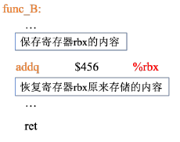

# 程序的机器级表示
1. 指令集架构（ISA，又称指令集体系结构）：定义机器级程序的格式和行为
2. 虚拟地址：机器级程序使用的内存地址都是虚拟地址，内存会被模拟成一个巨大的字节数组
3. linux上的指令：
   1. `gcc -Og -o prog main.c mstore.c` 
   编译选项og用来告诉编译器生成符合原始C代码的机器代码。如果想要更高性能，可以换用-O1或-O2，但是会导致机器代码变得极为抽象而难以理解 -o prog为生成可执行文件prog 
   1. `gcc -Og -S mstore.c` 生成汇编文件mstore.s  以.开头的行都是指导汇编器和链接器工作的伪指令，完全可以忽略。删除后，剩余汇编代码与源文件中代码是相关的。 
      1. pushq：将%rbx值压入栈
      2. popq：将%rbx弹出栈，恢复rbx
      3. 因为是mulstore这个函数自身去做保存，所以我们可以推知这个处理器采用调用者寄存器这个策略（这个部分请看[寄存器](#寄存器)中的2)
      4. moveq：将rdx中的内容复制到rbx
      5. 寄存器定义函数mulstore中的x、y和dest分别指向rdi、rsi和rdx。具体见<a name="change">寄存器中的3</a>
      6. call 调用函数，结果保存在rax
      7. ret：即函数返回，表示函数结束
      8. 汇编指令最后的q和数据有关，详见[数据格式](#数据格式)。q只是表示大小指示符，大多数情况下可省略
   2. `gcc -Og -c mstore.c` 生成目标代码文件mstore.o，是二进制格式
   3. `objdump -d mstore.o` 对二进制文件进行反汇编，去将其转换成对应的汇编语言。objdump可以将机器代码等进行反汇编为汇编语言
   4. `objdump -d prog` 对prog这个可执行文件进行反汇编
# 数据格式
1. Intel用术语“字（word）”表示16位类型，32位为双字，64位为4字。这些不同的数据类型决定了汇编代码后缀的不同: 
2.move指令的四个变种：moveb，传送字节；movw，传送字；movel，传送双字；moveq，传送四字
# 寄存器
   1. 寄存器： 
   2. 调用者保存寄存器和被调用者保存寄存器
      1. 问题来源：  其中，A为调用者（“主调函数”），B为被调用者（“被调函数”） 在执行中，我们不难发现，函数B会对%rbx中的内容进行修改，但是实际上函数就是函数，他不应该在A里面对%rbx这个位置的内容做任何变动，所以我们需要对这个位置的数值进行保护
      2. 调用者寄存器：函数A在调用函数B之前，提前保存寄存器rbx的内容，执行完函数B之后，再恢复寄存器rbx 原来存储的内容，这种策略就称之为调用者保存： 
      
      3. 被调用者寄存器：函数B在使用寄存器rbx之前，先保存寄存器rbx的值，在函数B返回之前，先恢复寄存器rbx原来存储的内容，这种策略被称之为被调用者保存： 
      
      4. 不同的处理器才用的调用者策略采用不同
   3. [寄存器的演变](#change)： 
      1. x86-64的CPU使用了16个存储64位值的通用目的寄存器，这些寄存器用来存放整数数据与指针
      2. 前8个处理器由于历史原因，命名方法与后8个不同。后8个采用的是新命名方法
      3. 最里层只能访问最低的1个字节。%ax这一层为16位寄存器，可以访问最低的两个字节。%eax这一层为32位寄存器，可以访问最低的4个字节。而最外层可以访问整个寄存器
      4. 