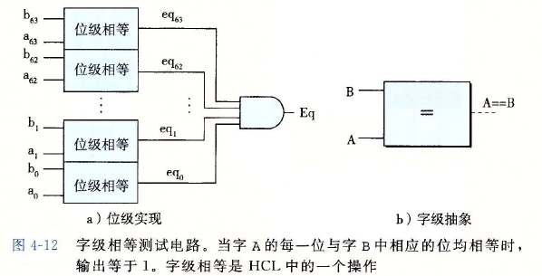
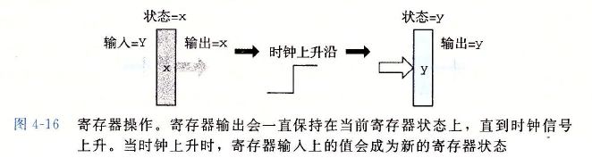

# 逻辑设计与硬件控制语言HCL
## 1. 逻辑门
1. 数字电路的基本计算单元，他只会对位进行操作
2. 它们产生的输出等于它们输入位值的某个布尔函数：<br><br>注意，逻辑门的操作符不同于C语言的位操作符
3. 一个门可以有多个输入。一般表达为n路操作，n>2。比如有3路，输入为a、b、c，HCL表示就是a&&b&&c
4. 逻辑门总是活动的，一旦一个门的输入变化了，那么输出也会迅速变化
5. C语言中，逻辑表达式，比如A&&B，如果A是false，那么便不会再识别B。但是逻辑门的位操作并不会这样，因为他每个门的计算是分开的

## 2. 组合电路
1. 组合电路：由很多逻辑门组合成的网
2. 连接要求
   1. 逻辑门的输入可以连接到下面3个环节：
      1. 系统输入
      2. 储存器单元的输出
      3. 逻辑门的输出
   2. 不同逻辑门的输出不可以连接在一起。
   3. 网不可成环
3. 例子
   1. `bool eq = (a && b)||(!a && !b)`：<br>
   2. `bool out = (s && a)||(!s && !b)`：<br>

## 3. 字级的组合电路
1. 字级组合电路会根据输入字的位，用逻辑门计算输出字的各个位
2. 判断a和b是否相等的一个字级组合电路的例子：<br><br>表达为`bool Eq= (A==B)`
3. HCL约定所有字级信号都为int
4. 字级电路中，用实线表示携带字的每个位的线路，虚线表示布尔信号的结果
5. 多路复用器电路：
   1. 从电路输入一个s，产生64位的out。这个效果等同于输入字A或B
   2. 这个电路只输入一次!s，然后在每个位的地方都重复使用它，从而减少非门的数量：<br>
   3. 多路复用函数在HCL中用情况表达式描述：<br><br>和C语言的switch不同，我们不要求选择表达式之间互斥，但实际上多路复用器信号必须互斥
   4. 表达式顺序求值，第一个求值为1（即true）的情况会被选中。HCL语言为：
   ```
   word Out = [
       s: A;
       1: B;
   ]
   ```
   这个例子中如果表达式s不符合情况，那么程序就会执行1的情况
6. 情况表达式的抽象表示：
   1. 设计一个电路，用HCL具体描述情况表达式MUX4：<br><br><br>右边的注释表明了s1和s0的什么组合才能导致该情况会被触发。比如10，就是s1=1，s0=0。<br>!s1&&s0不用写全，而是直接写!s1，因为!s1&&!s0的情况已经在情况1中了
7. ALU：
   1. 一共有三个输入：两个数据输入A和B，以及一个控制输入。控制输入都有自己的编号。下面是四则运算的例子<br>
8. 集合关系：
   1. 1个信号很多时候要对应多种情况，这时候我们就需要集合表示
   2. 示例：<br><br>s1与s0的信号情况为：<br><br>一般我们会使用集合表示<br>

## 4. 存储器和时钟
1. 组合电路不存储任何信息，他只是简单相应输入信号并输出结果
2. 时序电路：一种能够存储各种操作之间的信息的电路，具有记忆功能。
   1. 组合电路和存储元件互联后组成了时序电路
   2. 存储元件是能够存储二进制信息的电路。存储元件在某一时刻存储的二进制信息定义为该时刻存储元件的状态。
3. 时钟
   1. 存储设备由同一个时钟控制
   2. 时钟是一个周期信号，决定何时把新值加载到设备当中
4. 存储器：
   1. 时钟寄存器（简称寄存器）：存储单个位或字。时钟信号控制寄存器加载输入值
   2. 随机访问寄存器（简称内存）：存储多个字，用地址来选择读写哪个字。常见的例子有：
      1. 处理器的虚拟内存系统
      2. 寄存器文件：寄存器标识符作为地址，比如%rax
5. 寄存器的区分
   1. 硬件寄存器：硬件中，寄存器直接将它输入和输出线连接到电路的其他部分<br>寄存器在时钟到达上升沿才会读取新输入值：寄存器大多数时候保持稳定状态（用x）表示，输出等于它目前的状态。这时我们输入一个y。时钟如果是低电位，寄存器的输出就还是保持x；如果时钟变成高电位，输入信号y就会加载到寄存器。直到下一个时钟上升沿，寄存器状态会一直保持为y：<br>
   2. 软件寄存器：机器级编程，寄存器指的是CPU中为数不多的可寻址的字，地址为寄存器ID。这些字通常存在寄存器文件当中
      1. 寄存器文件有两个读端口A和B，还有一个写端口。这样一个多端口随机访问存储器允许同时进行多个读写操作<br><br>图示寄存器文件，电路可以同时读两个寄存器的值，并同时更新该寄存器状态。每个端口都有一个地址输入，表明该选择哪个程序寄存器src和dst表示地址，val表示值。
      2. 从寄存器文件读数据，以地址为输入，以数据为输出。输入srcA，会得到valA
      3. 向寄存器文件写入字由时钟信号控制。控制方式：将值加载到时钟寄存器，每次时钟上升，输入valW上的值会被写入dstW上的寄存器ID所指示的程序寄存器，当它被设置为0xF，不会写入任何程序寄存器
6. 随机访问存储器（RAM)：处理器一般有一个随机访问存储器来存储程序数据<br>
   1. 三个操作:地址输入、数据输入（读）、数据输出（写）
   2. 从内存中读数据：输入一个地址，并将写write的控制信号设置为0；如果地址超出范围，error信号会变为1。error默认值是0
   3. 写内存由时钟控制。提供地址，提供写入数据并把write设置为1。只要地址合法，我们控制时钟时就会更新内存指定位置的值。否则还是会抛出error
# Y86-64的指令集体系结构
## 1. 程序员可见状态
1. 程序员不仅指真的程序员，还包括产生机器级代码的编译器
2. 可见状态：只处理器中的某些部分。这些部分每条指令都会去读取或者修改<br>

3. 每个寄存器都存储一个64位的字
4. rsp为栈指针，其他寄存器没有固定含义
5. PC存放当前正在执行的指令的地址
6. Y86-64程序使用虚拟地址引用内存位置
7. 硬件和操作系统软件联合起来将虚拟地址转译为物理地址，用于指明数据实际存在内存中哪个地方
8. Stat记录程序执行的总体状态：是正常运行还是异常

## 2. Y86-64指令
1. X86-64指令集的子集
2. 每条指令均需要1~10个字节
3. 指令编码：
   1. 每条指令第一个字节表明指令类型。高4位为代码部分，低4位为功能部分。比如rrmovq，7表示他的指令类型，0表示他的功能：<br>
   2. 寄存器指示符字节
      1. 当指令中有寄存器作为操作数，指令会附加一个字节，这个字节被称作寄存器指示符字节。
      2. 这个字节可以存放一个或两个寄存器
         1. 为了方便操作，我们对寄存器进行了编号：<br>
         
         2. 只需要一个寄存器操作数的指令，比如irmovq、pushq、popq，一般会将另一个寄存器指示符设置为0xF。例子：<br>
         <br>V是立即数，所以第一个寄存器的位置为0xF
4. halt：00，可以使整个系统暂停运行
5. nop：10，表示一个空操作
6. call Dest：80，函数调用，Dest为我们需要调用的函数的名字
7. ret：90，函数返回
8. pushq rA：A0，入栈。rA为寄存器名字
9. popq rA：B0，出栈。rA为寄存器名字
10. mov指令：为了简化x86-64 的指令集，我们将x86-64 中的movq 指令分成了rrmovq、irmovq、rmmovq 和mrmovq 四种。前缀表示源操作数和目的操作数，后缀式数据操作类型。例如irmovq 的源操作数是立即数（Immediate），目的操作数是寄存器（Register）。
11. 其他操作：<br><br>
12. 将汇编代码转译成机械指令：
    1.  汇编代码：rmmovq %rsp, 0x123456789abcd(%rdx)
    2.  首先确定rmmovq，对应编码为0x40
    3.  rsp和rdx分别为0x4和0x2。按照rmmovq的语法规则，组成0x42
    4.  最后，偏移量放在常数字中。常数字占8字节，所以需要对偏移量补0，因此得0x000123456789abcd。因为处理器采用小端法，所以实际写入cd ab 89 67 45 23 01 00
    5.  综上，得机器指令：40 42 cd ab 89 67 45 23 01 00
13. 状态码：
    1.  AOK：程序正常执行
    2.  HLT：处理器执行halt指令
    3.  ADR：处理器试图从非法内存地址读或者向一个非法地址写入。可能是取指令的时候，也可能是读写数据的时候，我们会限制最大的地址，任何访问超出这个限定值的地址都会发生ADR
    4.  INS：非法指令
    5.  编码对应：<br>
    6.  一般而言，处理器通常会调用一个异常处理程序，用来处理各种程序异常，而不是像我们的Y86会直接让处理器停止执行指令

## 3. 程序的底层实现
1. Y86-64执行指令的过程组织成如下6个阶段：
   1. 取址：处理器执行所有的指令都需要取址。在Y86-64 指令系统中，指令的长度不是固定的，因此取址阶段需要根据指令代码判断指令是否含有寄存器指示符、是否含有常数来计算当前的指令长度。
   2. 译码：在译码阶段中，处理器从寄存器文件中读取数据。寄存器文件有两个读端口，可以支持同时进行两个读操作。
   3. 执行：指令被正式执行的阶段。在该阶段中，算术逻辑单元（ALU）主要执行三类操作：执行算术逻辑运算、计算内存引用的有效地址、针对push 和pop指令的运算。
   4. 访存：顾名思义，对内存进行读写操作的阶段。
   5. 写回：将执行结果写回到寄存器文件中。
   6. 更新：将PC 更新为下一条指令的地址。
2. 完整的汇编文件：
   1.  源代码：<br>
   2.  汇编文件：<br>
       1.  汇编器伪指令：以.开头的词，他告诉汇编器调整地址，以便产生代码或者插入数据
       2.  第二行：.pos告诉程序从地址0处产生代码，这个地址是所有Y86-64程序的起点
       3.  第三行：初始化栈指针。第39行.pos 0x200和第40行共同规定了栈从0x200这个地址开始，并且向低地址增长
       4.  8~13行：声明了一个4字的数组（2位16进制为1个字节，所以数组一个单元为16/2=8字节=64bits）。.align指定采用多少字节对齐。这里是8字节对齐。array表明数组的骑士
       5.  16~19：main函数的实现
       6.  sum函数：
           1.  Y86-64将常数加载到寄存器，因为它在算术指令中不可使用立即数。所以会`irmovq $8`, %r8和`irmovq $1, %r9`
3.  subq的指令拆解
    1.  指令：`subq %rdx, %rdx`指令码：6123<br>
    2.  取址阶段，根据指令代码来计算指令长度。我们看到指令存完之后，PC指针后移2字节
    3.  译码阶段，根据寄存器指示符来读取寄存器的值
    4.  执行阶段，ALU 根据译码阶段读取到的操作数以及指令来执行具体的运算，并设置条件码寄存器
    5.  访存阶段，由于减法指令不需要读写内存，因此该阶段无操作
    6.  写回阶段，将ALU 的运算结果写回寄存器
    7.  更新阶段，更新程序计数器
4.  irmovq拆解：
    1.  指令：<br>
    2.  取址阶段，该指令既含有寄存器指示符字节，也含有常数字段。
    3.  译码阶段，该指令不需要从寄存器中读取数据，译码阶段无操作。
    4.  执行阶段，虽然该指令仅仅传送数据，看似不需要ALU，但由于ALU 的输出端与寄存器的写入端相连，数据的传送还是需要经过ALU，因此该指令将立即数加0.
    5.  访存阶段，该指令不需要读写内存，因此该阶段无操作。
    6.  写回阶段，将ALU 的运算结果写回寄存器。
    7.  更新阶段，更新程序计数器。
5.  rmmovq：
    1.  指令：<br>
    2.  取址阶段，该指令既含有寄存器指示符字节，也含有常数字段。
    3.  译码阶段，从寄存器中读取数据。
    4.  执行阶段，ALU 根据偏移量和基址寄存器来计算访存地址。
    5.  访存阶段，将寄存器rsp 的数值写入内存中。
    6.  写回阶段，由于内存地址由执行阶段得出并写入寄存器，因此写回阶段不需要进行操作。
    7.  更新阶段，更新程序计数器。
6.  pushq：
    1.  指令：<br>
    2.  取址阶段，该指令含有寄存器指示符，不含常数，因此指令长度为2字节。
    3.  译码阶段，由于pushq 指令要将寄存器rdx 的值保存到栈上，因此该指令不仅需要读取寄存器rdx 的值，还需要读取寄存器rsp的值。
    4.  执行阶段，ALU 计算内存地址。
    5.  访存阶段，将寄存器rdx的值写到栈上。
    6.  写回阶段，由于寄存器rsp指向的内存地址发生了变化，因此更新寄存器rsp的值。
    7.  更新阶段，更新程序计数器。
7.  je：
    1.  指令：<br>
    2.  取址阶段，该指令含有常数字段，不含寄存器指示符字节，因此指令长度为9字节。
    3.  译码阶段，不需要读取寄存器，无操作。
    4.  执行阶段，标号为Cond 的硬件单元根据条件码和指令功能来判断是否执行跳转，该模块产生一个信号Cnd，若Cnd = 1，则执行跳转；Cnd = 0 则不执行跳转。
    5.  访存阶段，无操作。
    6.  写回阶段，无操作。
    7.  更新阶段，若Cnd = 1，将PC 的值设为0x040；若Cnd = 0，则将PC的值设为当前值加9
8.  6阶段的硬件设计
    1.  取址：
        1.  取址操作以程序计数器（PC）的值为起始地址。由于Y86-64 指令集中最长的指令占10 字节，为了保证每次取址操作至少能够获得一条完整的指令，取址操作每次从指令内存中读取10各字节
        2.  然后将10字节切成2部分，第一部分1字节，第二部分9字节
        3.  第一部分的相关处理
            1.  随后名为Split 的硬件单元处理第一部分。它将这个字节又分成两部分，每部分占4个比特位，使这个字节分为两个字段，分别为指令代码和指令功能，用icode 和ifun 表示
            2.  根据icode 可以确定当前指令的状态信息，例如指令的合法性。如果icode 在0x0到0xB 之间，那么它就是一条合法指令。此外，通过icode 还可以判断当前指令是否包含寄存器指示符字节和常数字节
            3.  通过前面说的判断结果，就可以计算出当前指令的长度。例如一个指令既含寄存器指示符字节，又含常数字节，那它的长度就是10 字节；如果既不含寄存器指示符字节，又不含常数字节，那它的长度就是1 字节。
        4.  第二部分的处理：
            1.  我们通过名为Align 的硬件单元来产生寄存器字段和常数字段。该硬件单元通过信号need_regids来判断该指令是否包含寄存器指示符字节。若need_regids = 1，说明该指令包含寄存器指示符字节，那么第一个字节将被分成两部分，每部分占4 个比特位，然后分别装入寄存器指示符rA 和rB 中；若need_regids = 0，说明该指令不包含寄存器指示符字节，此时将rA、rB 这两个字段设置为0xF。
            2.  若该指令含有常数，Align 单元还将产生常数字段valC。当need_regids = 1时，valC 被设为指令的第2 ∼ 9 字节；当need_regids = 0 时，valC 被设为指令的第1 ∼ 8 字节。
        5.  PC 值加上当前的指令长度来计算内存中下一条指令的地址，用于后续的更新阶段
    2.  译码：
        1. 译码阶段的操作是从寄存器文件中读取数据，在Y86-64 处理器中寄存器文件有两个读端口，它支持同时进行两个读操作，两个读端口的地址输入为srcA 和srcB，从寄存器文件中读出的数值通过valA 和valB 输出 
        2. 读端口的srcA 和srcB 用于产生寄存器的ID，这需要寄存器指示符rA及rB
        3. 某些指令，例如push 指令，该指令的寄存器指示符中只含有目的寄存器的ID，但执行压栈操作时，还需要获得栈顶指针rsp 的值。因此srcA 和srcB 不仅需要传入rA 和rB，还需要传入指令代码icode
    3. 执行：
       1. 执行阶段的核心部件ALU 根据指令功能ifun 来判断要对输入的操作数进行何种运算。每次运行时，ALU 都会产生三个与条件码相关的信号——零、符号、溢出
       2. 我们只希望ALU 在执行算术逻辑指令时才设置条件码，而计算内存引用地址以及栈操作时不要设置条件码。因此我们使用Set_CC 信号根据指令代码icode 来控制是否需要设置条件码。
       3. 我们使用名为Cond 的硬件单元来控制跳转操作。Cond 会根据指令功能和条件码寄存器来产生Cnd 信号。对于跳转指令，如果Cnd = 1，就执行跳转；如果Cnd = 0，则不执行跳转。
    4. 访存阶段：
       1. 该阶段的硬件设计主要包含以下四个控制块：
          1. 读控制块，用于进行读操作。
          2. 写控制块，用于进行写操作。
          3. 内存地址控制块，用于产生内存地址。
          4. 数据输入控制块，用于输入数据
       2. 除此之外，访存阶段的最后还将根据icode 判断出的指令有效性以及内存状况产instr_valid 和imem_error 信号来计算状态码
    5. 写回阶段：
       1. 首先为寄存器文件系统添加M 和E，这两个写端口，对应的地址输入为dstE 和dstM。
       2. 需要注意的是，当执行条件传送指令(cmov) 时，写入操作还要根据执行阶段计算出的cnd 信号，当条件不满足条件时，以将目的寄存器设置为0xF 来禁止写入寄存器文件。
    6. 更新阶段：
       1. 当前执行的指令是函数调用指令call，此使将PC 值设为call 指令的常数字段
       2. 当前执行的指令是函数返回指令ret，此使将PC 值设为ret 指令在访存阶段从内存中读出的返回地址。
       3. 当前执行的指令是跳转指令jxx，此使若满足跳转条件（cnd = 1），则新的PC值等于跳转指令的常数字段；若不满足跳转条件（cnd = 0），则新的PC 值等于当前PC 值加上当前指令长度。