# 优化编译器的能力与局限性
1. 编译器经常利用一些机会简化表达式，降低计算的执行次数
2. 大多数编译器允许用户决定优化级别
   1. GCC通过`-Og`调用GCC的基本优化
   2. `-o1`和`-o2`是更高级别的优化，但是会造成程序规模的增加或者调试难度的增加
   3. 有时高级别优化可能反而会导致程序性能损失
3. 内存别名使用导致的优化阻碍<br>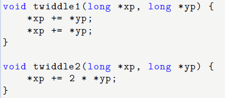
   1. 在这两段代码中，函数twiddle2 的效率更高。
      1. twiddle2：`*xp += 2 * *yp;`这句执行了一次读取\*yp，一次读取\*xp，然后将计算的结果写入\*xp。一共执行3次读写操作
      2. twiddle1：`*xp += *yp;`每次执行都会执行一次读取\*yp，一次读取\*xp，然后将计算的结果写入\*xp。一共两句，所以共执行6次读写操作
   2. 照理说，如果我们把代码写成twiddle1形式，编译器为了效率应该帮我们优化成twiddle2这种形式。但是现实中编译器不会这样做
      1. 考虑xp=yp的情况：
      ```
      //twiddle1:
      *xp += *xp;/2 * *xp/
      *xp += *xp;/2 * (2 * *xp)/
      
      //twiddle2:
      *xp += 2 * *xp; /*xp + 2*xp/ 
      ```
      2. 此时我们发现twiddle2和twiddle产生的结果不一样，所以编译器不会使用优化
      3. 内存别名使用：这种两个指针可能指向同一个内存的情况叫做内存别名使用
      4. 对于执行安全优化的编译器来说，编译器在面对内存别名使用的情况时不会进行优化
   3. 内存指向未知带来的优化阻碍
      1. 有代码：<br>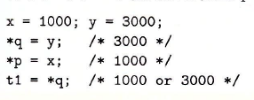
      2. 因为我们起初明没有给出指针p与指针q的初始化代码。如果p和q指向的地址不同，那么t1=3000。但是如果两个指针指向的地址相同，那么*p=x会让这个地址最后对应的值为1000，导致t1=1000
      3. 因此，如果编译器如果无法确定两个指针的地址是否相异，那么他们会假设所有情况都会发生，限制了可能的优化策略
4. 函数调用导致的优化阻碍：
   1. 代码：<br>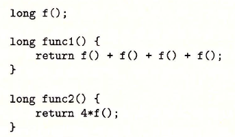
   2. 这个代码的func1和func2看似相同，但是func2却不能作为func1的优化。因为如果有<br>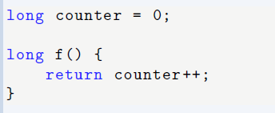<br>此时func1返回6（0+1+2+3=6），func2返回0（4*0=0）
   3. 大多数编译器会假设最糟的情况，因此保持原有调用不变而不会对其优化
   4. 关于`x++`和`++x`：“x++”是先把值参与运算以后，自身再进行加一的，而“++x”是自身先加一再参与运算。即如果y=x++，那么y=x，然后x再对自己执行+1；y=++x，是先对x+1，然后再赋值给y

# 程序性能的表示
1. 度量标准：每元素的周期数（CPE）
   1. 对于一个程序，如果我们记录该程序的数据规模以及对应的运行所需的时钟周期，并通过最小二乘法来拟合这些点，我们将得到形如y = a + bx 的表达式，其中y 是时钟周期，x 是数据规模。
   2. 当数据规模较大时，运行时间就主要由线性因子b 来决定。这时候，我们将b 作为度量程序性能的标准，称为**每元素的周期数**
2. 处理器活动由时钟控制，时钟控制某个频率的规律信号，用千兆赫兹（GHz）表示
   1. 千兆赫兹即十亿周期/秒
   2. 4GHz处理器表示处理器时钟运行频率为每秒$4 \times 10^9$
   3. 我们以纳秒（$10^{-9}$秒）或皮秒（$10^{-12}$秒）表示处理器的时钟周期。比如4GHz的1次时钟周期为0.25纳秒或者250皮秒


## 如何优化
## 1. 程序示例
1. 定义一个向量<br>: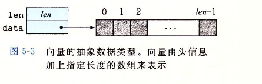<br>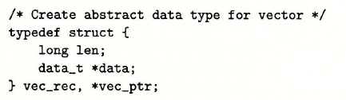<br>data_t为基本元素的数据类型：<br>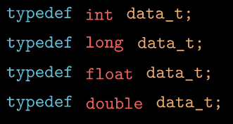
2. 对向量求和或者求积：<br>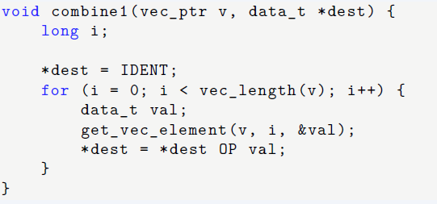
   1. OP：OP是一个运算符，具体是求积还是求和取决于我们下面的定义：
        ```
        #define IDENT 0
        #define OP +

        #define IDENT 1
        #define OP *
        ```
   2. get_vec_element：获取第i个元素的值，并把结果保存在val中
   3. 运行效率对比：<br><br>我们发现O1的优化方法可以显著提高程序性能

## 2. 消除循环的低效率：减少重复计算
1. 代码移动：
   1. 主要针对要在循环中执行多次但是计算结果不会改变的计算，因此我们把计算移动到循环之外进行计算
   2. 编译器会试着进行代码移动，但是出于安全性考虑，最好还是由程序员进行手动改进
2. 例子：<br>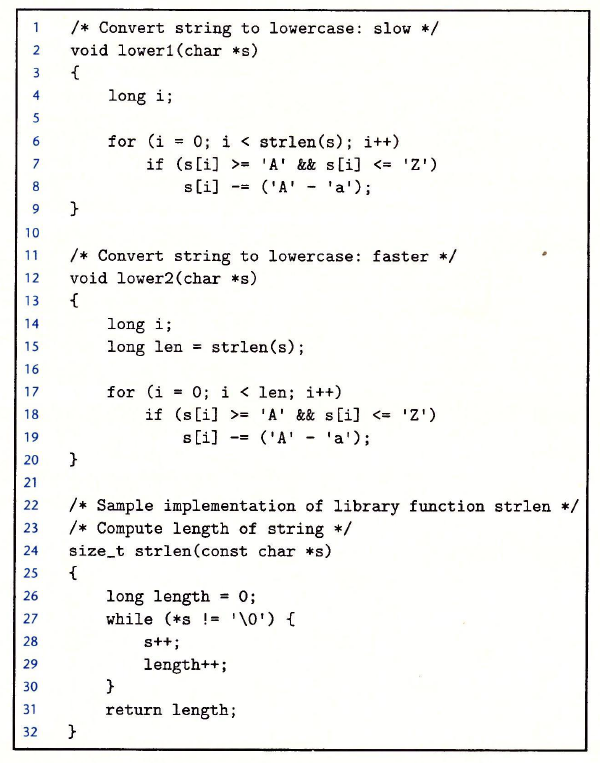<br>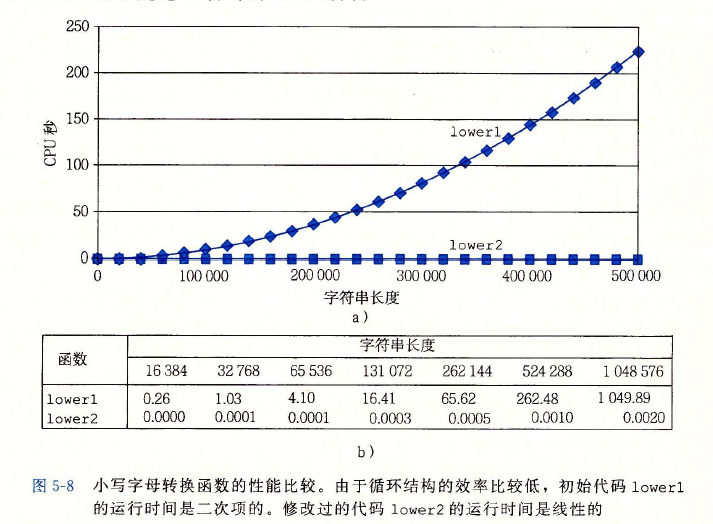
   1. 我们在lower2中就把在lower1中反复计算的strlen()移除了循环，大大提升了程序的运算速度
   2. str(len)是依靠循环测验字符串长度，所以lower1的复杂度是$n^2$。但是lower2因为提前计算好的，程序复杂度只有$n$

## 3. 减少过程调用
1. 构成调用会带来开销，并且妨碍程序优化
2. 这个例子中，每次循环都会调用函数get_vec_element<br>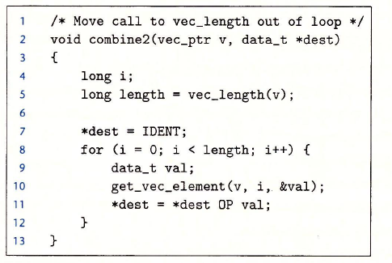<br>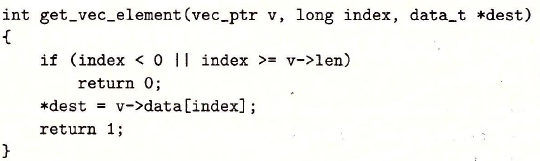
   1. get_vec_element每次都会获取下一个向量元素，同时检查i是否超出循环边界。尽管这是一个很好的安全意识，但是combine2明显没有越界引用，那么这种检查就是多余的
   2. 我们使用如下的优化，即减少循环中的函数调用：<br>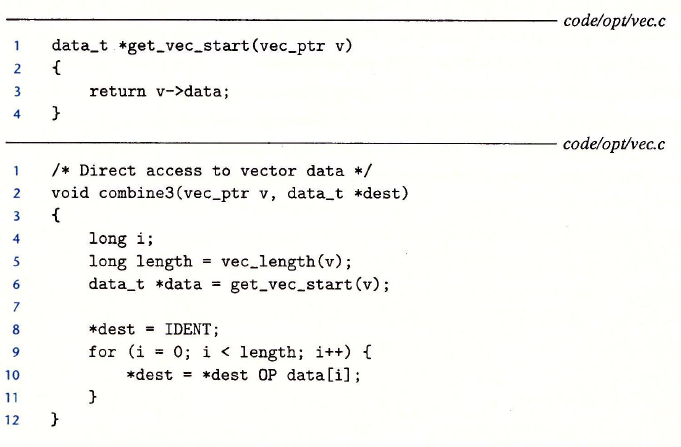<br>我们使用get_vec_start直接获取数组指针，然后直接在循环中访问数组
   3. combine3中的[OP](#1-程序示例)在前面给出了定义，他会根据输入值得不同决定这是加或乘
   4. 实际上，combine3效率还弱于combine2，这是因为其他部分出现了问题，我们将在[消除不必要的内存引用](#4-消除不必要的内存引用)进行解释。但是这种减少调用的习惯是必要的

## 4. 消除不必要的内存引用
1. combine3的分析：<br>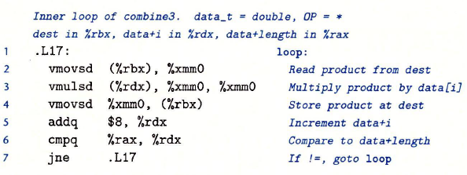
   1. 这里我们发现在运算时，先要吧dest的值从rdx对应的地址位置取出，存储在xmm0中。在计算完毕后，再把xmm0计算完的\*dest的值存回rbx。这样的反复读写是浪费效率的
2. combine4：避免了反复读写：<br>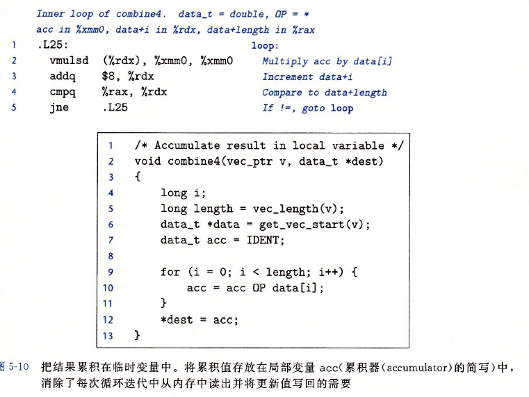
   1. 这种改写避免了对指针寄存器的反复操作。通过引入一个临时变量acc记录每次的计算值。因为acc是一个非指针变量，因此计算时会永远存在xmm0中，全部计算完成后再放入\*dest
   2. 编译器很难将combine3优化成combine4，因为存在**内存别名**的情况，导致两个函数会导致不同行为：<br>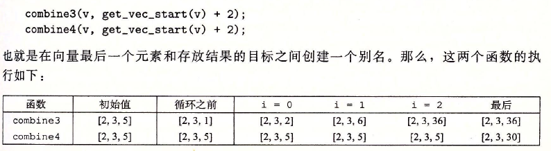
      1. IDENT的定义：<br>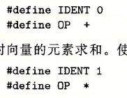<br>这里我们假定IDENT=1,OP为乘号
      2. combine3因为是利用指针操作，并且\*dest就是v[2]，所以一开始\*dest=IDENT会改变v最后的值。并且每次改变\*dest的值时我们都会改动v[2]。当i=2时，我们执行的不是6\*5，而是$*dest \times (*dest)=6\times 6 = 36$
      3. 而对于combine4，我们对中间变量acc赋值IDENT，而不是对dest操作，所以我们的向量v并没有发生任何变化。combine4这种函数明显更符合我们对于函数的要求，但是编译器不会分辨他和combine3的区别，只会认为这两个都一样好

# 现代处理器的运作
1. 实际处理器，会同时对多条指令求值，这个叫指令级并行
2. 当一系列必须按照严格顺序执行（即必须这条指令执行完才能执行下一个指令），就会遇到延迟界限。
3. 延迟界限是阻止处理器进行指令级并行的主要障碍
4. 吞吐量界限刻画了处理器功能单元的原始计算能力，这个界限是程序性能的终极限制
## 1. 处理器整体情况
1. 超标量：即处理器可以在每个时钟周期乱序执行多个操作（即指令执行顺序不必与机器级程序中顺序一致）
2. 乱序处理器往往比in-order的流水线比更大且更复杂，但是有更好的并行能力
3. 乱序处理器主要分为两个部分：指令控制单元（ICU）和执行单元（EU）
   1. ICU：从内存中读取指令序列，并根据指令序列生成一组针对程序数据的基本操作
      1. ICU从指令高速缓存读取指令
      2. 指令高速缓存：一个特殊的高速存储器，保存最近访问的指令
      3. ICU通常在指令执行很早之前就取指，以便发给EU。但是遇到分支时，需要进行分支预测
      4. 分支预测：处理器猜测会选择哪一个分支以及其目标地址
      5. 投机执行：处理器会开始取出位于它预测的分支，并跳转到指定位置读取并让EU执行。如果预测错误，处理器会将状态重新设置到分支点状态，并重新计算正确分支
      6. 指令译码：接收实际的程序指令，并将其转化成一组基本操作。比如x86会将一个复杂的运算译码成多个简单操作。译码采用队列处理指令，先进先出
      7. 退役单元：记录正在进行的处理，确保他们遵循机器级程序的顺序。
         1. 寄存器文件是退役单元的一部分，因为退役单元控制这些寄存器的更新
         2. 指令译码时会采用队列，先进先出。一条指令一旦译码完成，如果不存在分支预测错误则该指令退役，该指令的操作会被执行。如果预测错误，该执行会被退役单元清空
   2. EU：执行从ICU生成的操作
      1. EU每个时钟周期会接收多个操作，这些操作被分派到一组功能单元中执行实际的操作。每个功能单元都有自己专门的处理类型
      2. 读写内存：由加载和存储单元实现。它通过数据高速缓存来访问内存。在读写数据的过程中，有一个加法器会协助单元完成地址计算
      3. 投机执行技术会将计算出来的值发送给EU，让EU判断正确与否。如果错误，分支单元会接收EU的信号后把告知ICU分支预测错误，并指出正确分支
      4. 各执行单元可以直接将结果发送给彼此（在图中就是“操作结果”那条横线）
   
   3. 流程图：<br>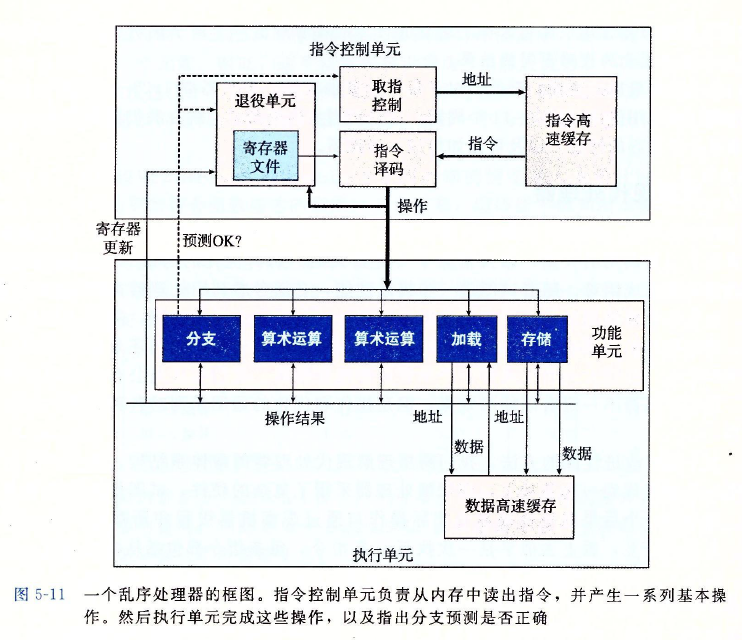
   4. 每个单元执行的功能并不是单一的：<br>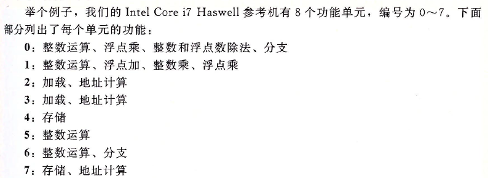
   5. 寄存器重命名：保证了即使在处理器确定了分支结果之后才能更新寄存器也可以预测着执行操作的整个序列
      1. 当一条更新寄存器r的指令译码时，记录映射(r,t)，t为此时r的标记。这个映射被记录在一张表中
      2. 在操作寄存器r时，发送给执行单元的操作会包含t作为操作数源
      3. 指令执行完成，产生一个新映射结果（v,t），指明操作数源t会产生结果v。
      4. 有了这个映射，处理器会把所有以t作为操作数源的操作的结果都处理为v
      5. 这种操作可以让相同操作不必再读写寄存器，加快了操作，并且保证了不会因为乱序导致操作结果出现错误

## 2. 功能单元的性能
1. 运算的指标：<br>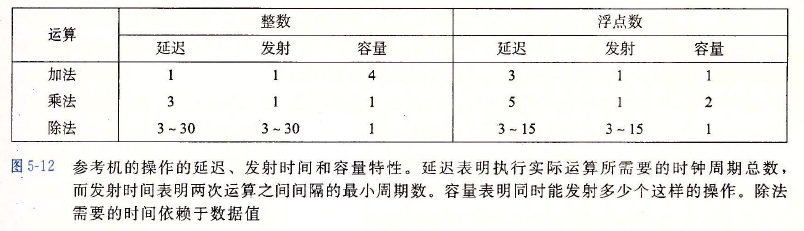
   1. 延迟（latency）：完成运算的所需时间
   2. 发射时间（issue time）：指处理器某个功能单元通过流水线执行一系列相同操作时，两个操作间隔的时钟周期
   3. 容量（capacity）：能够执行该运算的功能单元数
2. 流水线：可以实现很短的发射时间
   1. 流水线化的功能单元可以将运算切分成多个阶段。比如浮点数一般分为三个阶段运算：处理指数、将小数相加、对结果进行舍入。算术运算通过这种阶段划分，可以不用等待一个操作完成之后在开始下一个
   2. 发射时间为1的功能单元被称为完全流水线化
   3. 除法不是完全流水线化，因此在开始一个新运算之前，处理器必须先处理完除法运算才可以
3. 吞吐量：一般定义为发射时间的倒数
   1. 完全流水线化的功能单元可以有最大的吞吐量
   2. 有一个操作，容量为C，发射时间为I，那么处理器的吞吐量为每个时钟周期C/I个操作
4. 延迟界限：当一系列操作必须按照严格顺序执行时，就会遇到延迟界限。
5. 吞吐量界限：吞吐量界限为程序性能的终极限制，即功能单元产生结果的最大速率
   1. 吞吐量界限不止和容量C、发射时间I有关，还和加载速度有关
   2. 比如执行加法，一共有4个处理单元，且发射时间为1，但是吞吐量不是0.25，而是0.5。因为加载单元一个时钟周期最多读取2个数值

## 3. 数据流
1. 数据流：展示不同操作之间的数据相关是如何限制它们的执行顺序的
2. 关键路径：执行一组机器指令所需时钟周期的下界
3. combine4的数据流：
   1. 编译指令：<br>
   2. 数据流：
      1. 图形化表示<br>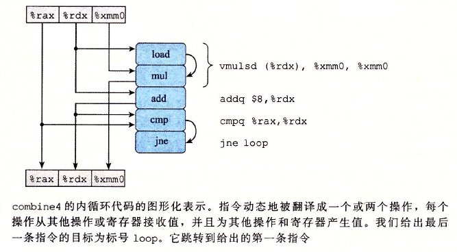
         1. 译码阶段，vumlsd被拆分
         2. 顶部方框表示寄存器的初始状态，底部方框表示寄存器在结束运算后的状态
         3. 弧线表示各个操作之间的连接。因为有些操作产生的值和任何寄存器都无关。比如cmp执行，只是为了jne指令做出判断是否跳转，因此这两个指令还需要用弧线连接
      2. 数据流图：<br>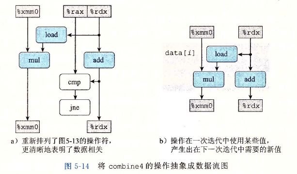
         1. 左图：不影响某个循环寄存寄存器的操作我们设置为白色。cmp和jne就是不影响寄存器值的操作
         2. 右图：只保留了循环寄存器
      3. 循环n次的数据流图：<br>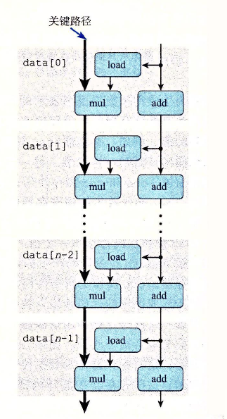
         1. 重复5-14b的图n次得到
         2. 假设乘法延迟为5，加法延迟为1，那么左侧mul路径就会成为**关键路径**，需要5n个周期执行（add的路径只需要n个周期）。他会作为制约程序性能的关键
         3. 加法与数据存取操作会在计算乘法时同时进行，因此加法不会对程序性能产生制约
4. 四类寄存器：
   1. 只读：这些寄存器只作为数据或者用来计算内存地址，但是不会被修改（combine4中的rax）
   2. 只写：只负责传输数据，combine4中没有只写寄存器
   3. 局部：在循环内部被修改和使用，但是每一次循环中都会更新值。条件码寄存器就是一个典型局部寄存器
   4. 循环：即作为源值，又作为目的，并且这一次迭代中产生的值会在下一次迭代中使用。%rdx和%xmm0就是循环寄存器
5. 数据流表示的关键路径只是提供程序需要周期数的下界，但是会有其他一些因素制约程序速度，比如说存取数量限制。所以数据流只是一个抽象参考

# 循环展开
1. 循环展开一般由编译器来做
2. 好处：
   1. 减少了不直接有助于程序结果的操作的数量。比如循环index的计算
   2. 减少整个计算中关键路径上的操作数量
3. $2 \times 1$展开：<br>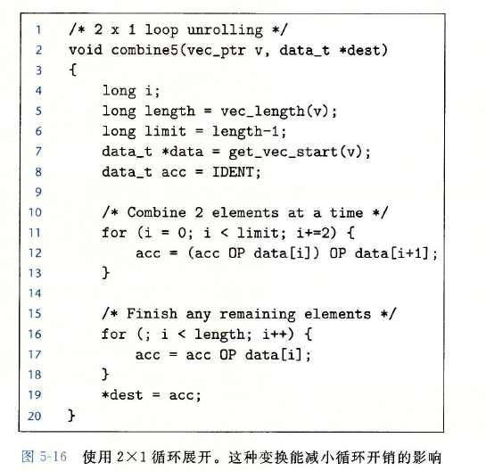
   1. 每次计算计算i和i+1，这样可以减少一半的循环次数
   2. 但是我们不能保证数组一定是2的倍数，所以我们把第一次循环边界设为n-1，这样索引$i+1<(n-1)+1=n$可以覆盖数组所有值
   3. 最后一个循环主要是处理末尾元素的
4. $k \times 1$展开：
   1. 设上限为n-k+1
   2. 在循环内对元素i~i+k-1做合并运算
   3. 循环的increment为i+=k
   4. 整体循环共0~k-1次
5. 程序优化不会突破延迟界限（这里以乘法为例）：<br>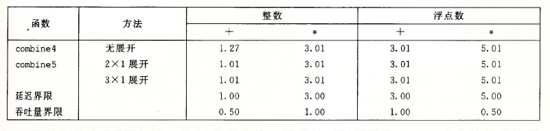
   1. 循环展开优化速度不会突破延迟界限。因此拉高k值也不会加快速度
   2. 为什么性能优化无法超过延迟界限？我们使用数据流分析<br>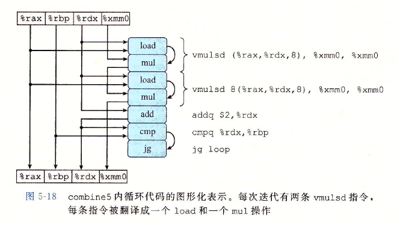<br>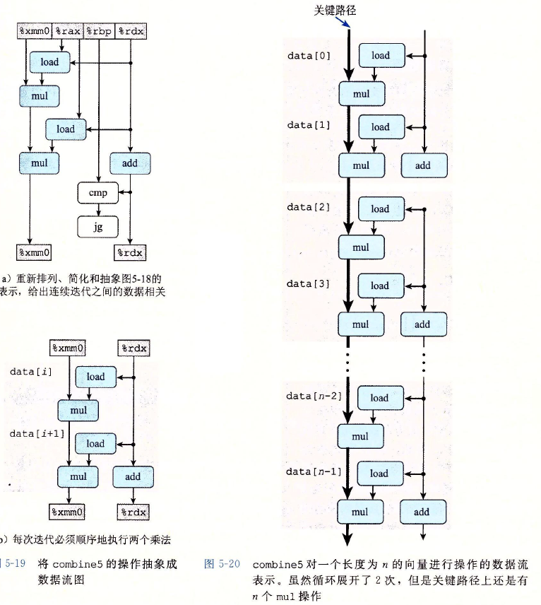<br>我们发现关键路径依然是mul，并且mul数量为n。即k展开并没有减少关键路径的mul数量，如果乘法延迟为5，那么程序最终CPE还是5n

# 并行化
